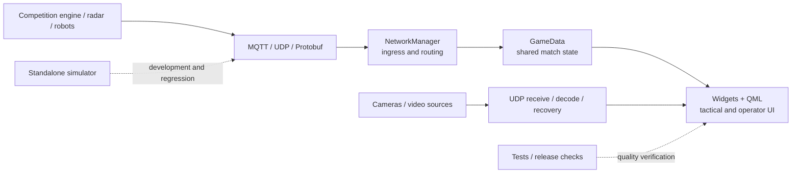

# RM26 Custom Client — RoboMaster Operator Client and Simulator

[简体中文](README.md) · [English](README.en.md)

A custom operator client and battlefield information terminal for RoboMaster competition. It turns
match state, robot telemetry, radar, and multiple video feeds into one actionable tactical picture.
It also includes a standalone simulator so developers can exercise the main data paths without a
complete field or physical robots.

The project grew out of Fudan University Nebula EGA's training and competition work during the 2026
season. It has evolved around operator attention, graceful degradation, and evidence-based
development.

> [!IMPORTANT]
> The project source code is released under the [MIT License](LICENSE). The maintainers have
> approved the assets distributed with this source release; see the
> [asset register](ASSET_LICENSES.md) for the exact scope. Third-party names and marks remain the
> property of their respective owners.

This project is independently developed by a community team, with no affiliation or official
partnership with DJI or RoboMaster. RoboMaster, DJI, and related marks belong to their respective owners.

## One-minute overview

| What the project cares about | How it responds |
| --- | --- |
| Can the operator see the whole field? | Bring match state, positions, health, key events, and data freshness into one tactical view |
| Does important information arrive in time? | Organize UI, audio, and layered alerts by role and urgency to reduce active searching |
| Can operation continue when the primary view fails? | Use a configured backup source when available, then return to the tactical view after recovery |
| Can development continue without a complete field? | Use an independent protocol peer for match state, commands, and video while keeping the production client on its normal data paths |
| Can behavior survive refactoring? | Capture evidence with client tests, simulator tests, and release checks before moving boundaries |

## Choose your path

| What you want to do | Start here | What you will learn or produce |
| --- | --- | --- |
| Decide whether the project fits your needs | Read [Capabilities](#capabilities) and [Release scope](#release-contents-and-scope) | Features and operating conditions |
| Build and run the client | Follow the [Quick start](#quick-start) | A local executable and basic runtime environment |
| Exercise match data without the client | [Start the simulator](#3-start-the-simulator) | A browser-controlled, independent protocol peer |
| Understand the architecture and data paths | Follow the [learning path](docs/learning-path.md) (Chinese) | A source-reading route from ingress to QML |
| Prepare a change | Read the [contributing guide](CONTRIBUTING.md) | Development, testing, safety, and commit requirements |

## Why this project exists

A match produces plenty of information, while operators have very little attention to spare on the
interface. RM26 Custom Client brings scattered inputs into one tactical picture and presents them
according to role and urgency:

- **See the whole field:** combine positions, health, match state, key events, and data freshness.
- **Know sooner:** deliver important information through a tactical map, audio, and layered alerts.
- **Keep operating:** when a configured backup source remains available, present an alternative
  view after primary-view failure. Actual availability still depends on field links and configuration.

The system has been used in training and competition workflows during the 2026 season. That usage
describes its deployment background; latency, reliability, and other engineering conclusions follow
the reproducible records in the [verification guide](docs/development/verification.md) (Chinese).

## Capabilities

| Area | What it provides |
| --- | --- |
| Tactical picture | Full-screen map, red/blue perspectives, position and health fusion, stale-data cues |
| Operator UI | Qt Widgets and QML interface with role-specific layouts and resolution adaptation |
| Competition links | MQTT, UDP, and Protobuf for state ingestion and competition commands |
| Video pipeline | UDP reassembly, H.264/H.265 decoding, a low-latency-oriented display path, and stream recovery |
| Event alerts | Visual and audio cues for base, outpost, dart, energy mechanism, and other events |
| Standalone simulator | FastAPI and Socket.IO web console for match state, commands, and video simulation |
| Engineering checks | C++/Qt tests, simulator tests, and configuration, documentation, and release-integrity checks |

## Boundaries between the client, simulator, and tools

- `src/` is the production Qt/C++ client for network ingress, shared match state, video processing,
  and the operator UI.
- `sim/` is a separately launched protocol peer that provides controlled input off the field. The
  real competition system still requires its own integration session.
- `tests/` and `tools/release/` form the development and release verification layer. The production
  client has no runtime dependency on these directories.
- Real competition commands and remote field actions require explicit operator authorization;
  automation does not issue them on its own.

## System overview



See the [architecture overview](docs/architecture/overview.md) and
[protocol boundary](docs/architecture/protocol-boundary.md) for component responsibilities,
thread ownership, data flow, protocol targets, and official source references. These deep-dive
documents are currently maintained in Chinese.

## Quick start

The following steps take a fresh clone through local client and simulator setup. Connect both
programs to the same MQTT broker to exercise the main data paths. The public example uses loopback
addresses throughout, so no competition system or field network is required.

### 1. Install dependencies

Minimum requirements:

- CMake 3.21 or newer for Presets; explicit configuration supports CMake 3.16 or newer
- A C++17 compiler
- Qt 6: Core, Concurrent, Widgets, Multimedia, Network, SerialPort, Svg, Quick, QuickWidgets, QuickControls2; test builds also require Test
- Protobuf and Abseil
- Paho MQTT C (MQTT support is disabled when unavailable)
- FFmpeg (optional; H.264/H.265 decoding is limited when unavailable)

On macOS with Homebrew:

```bash
brew install cmake qt@6 protobuf abseil libpaho-mqtt ffmpeg
```

For the complete Ubuntu 24.04 dependency list, see
[docker/client.Dockerfile](docker/client.Dockerfile).

### 2. Build the client

In a fresh clone, create the local configuration from the public example. Do not overwrite an
existing team workspace that already contains field configuration:

```bash
# macOS / Linux
cp config.example.json config.json
python3 tools/release/check_example_config.py config.json

# Windows PowerShell
Copy-Item config.example.json config.json -Force
python tools/release/check_example_config.py config.json
```

The example only connects to `127.0.0.1` and contains no model, video, or field identity.
`config.json` is a Git-ignored local file; only `config.example.json` belongs in a commit. The
[configuration guide](docs/getting-started/configuration.md) documents every field, code fallback,
environment override, and lookup location. If the root `config.json` is absent, CMake generates a
safe runtime configuration from the public example in the build directory. Copying and reviewing a
local file is still recommended before integration work.
Docker builds exclude the local configuration as well. Prepare the root `config.json` before using
Compose; it is mounted read-only at runtime so field parameters do not become part of an image layer.

Local integration requires three values to agree: the client and simulator must use the same MQTT
broker and robot ID; the primary video feed listens on the UDP port in `video.stream_url`; and the
hero industrial-camera feed reuses MQTT `CustomByteBlock` rather than a second UDP port.

Use the repository presets:

```bash
cmake --preset release
cmake --build --preset release
```

Or choose the build directory and options explicitly:

```bash
cmake -S . -B build \
  -DCMAKE_BUILD_TYPE=Release \
  -DBUILD_TESTING=ON \
  -DRM26_ENABLE_DEVTOOLS=OFF
cmake --build build --parallel
```

The executable target uses the compatibility name `RoboMasterClient2025`. The 1.x series keeps this
name for existing scripts and packaging workflows; a canonical-name migration belongs in a future
major release.

Run the application:

```bash
# With the release preset (Linux)
./build/release/RoboMasterClient2025

# With the explicit build directory (Linux)
./build/RoboMasterClient2025

# With the release preset (macOS)
./build/release/RoboMasterClient2025.app/Contents/MacOS/RoboMasterClient2025

# With the explicit build directory (macOS)
./build/RoboMasterClient2025.app/Contents/MacOS/RoboMasterClient2025

# Windows with a Visual Studio multi-config generator
.\build\release\Release\RoboMasterClient2025.exe

# Windows with a Ninja single-config generator
.\build\release\RoboMasterClient2025.exe
```

Review the `config.json` that will actually be loaded before the first run. It belongs only to the
local runtime environment. Never commit real IP addresses, credentials, captures, or match run
artifacts.

After a successful build, the `RoboMasterClient2025` target should exist in the corresponding output
directory. With no data source connected, the client displays an empty state. Match data appears
after the simulator starts or a test broker connection is available.

### 3. Start the simulator

The simulator requires Python 3.11 or newer. The commands below explicitly match the public example:
MQTT `127.0.0.1:3333` and robot ID `1`. The launcher reuses an existing broker or attempts to start
local Mosquitto.

```bash
python3 -m venv sim/.venv
source sim/.venv/bin/activate
python -m pip install --upgrade pip
python -m pip install -e sim
./sim/run_sim.sh \
  --no-video \
  --mqtt-host 127.0.0.1 \
  --mqtt-port 3333 \
  --current-robot-id 1
```

Open `http://127.0.0.1:8000` after startup. See the
[simulator guide](sim/README.md) for options, ports, and isolated tests. To simulate the primary
feed, pass an authorized local clip with `--video-file <path>`; it sends HEVC to client UDP `3334`.
Select and start the second industrial-camera feed in the Web console; it sends H.264 as
`CustomByteBlock` over the same broker. The Chinese
[two-feed configuration reference](docs/getting-started/configuration.md#两路视频怎样配置) gives the
complete mapping.

## Verification

```bash
# C++ / Qt tests
cmake --build --preset release
ctest --preset release

# Public configuration and release tooling
python3 tools/release/check_example_config.py
python3 -m unittest discover -s tools/release/tests -p 'test_*.py' -v

# Standalone simulator tests
python3 -m unittest discover -s sim/tests -t sim -p 'test_*.py' -v
node --test sim/tests/test_map_geometry.js

# Documentation, resources, and public-snapshot checks
python3 tools/release/check_docs.py
python3 tools/release/check_runtime_resources.py
python3 tools/release/check_public_readiness.py
```

The [verification guide](docs/development/verification.md) records required checks, reference
results, and their applicable environments. When a test fails, include the full
command, platform, build options, and log rather than reporting only that it failed locally.

Automated tests cover deterministic match progression, map-coordinate conversion, and protocol
compatibility, and run in Quality CI. Changes involving the broker, video streams, or client
rendering should also include an isolated integration or end-to-end check.

### Verification scope

Quality CI runs repository checks, QML checks, a native build, CTest, release-tool tests, and
simulator tests on Ubuntu 24.04. Windows, long-running Linux desktop use, the real competition
system, network degradation, and full field actions require verification in their target
environments. The Chinese [verification guide](docs/development/verification.md) lists commands,
applicable environments, and reference records.

## What you can learn from the project

The repository combines a working interface with architecture notes, key data paths, and
verification material. Useful study topics include:

- **End-to-end state flow:** how an MQTT/Protobuf message enters the networking layer, updates
  `GameData`, and drives Widgets and QML.
- **Hybrid Qt desktop architecture:** how the main window, native widgets, and tactical QML view
  divide responsibilities and manage thread lifecycles.
- **Low-latency-oriented video path:** how UDP fragmentation, reassembly, FFmpeg decoding, recovery,
  and presentation work together.
- **Controlled development without robots:** how an independent simulator, automated tests,
  protocol compatibility checks, and explicit operator authorization reduce regression risk.

The [learning path](docs/learning-path.md) (Chinese) links each goal to source entry points, concepts,
and suggested exercises.

## Repository layout

```text
.
├── src/                  # Production Qt/C++ client
│   ├── core/             # Match state and domain data
│   ├── network/          # MQTT, UDP, protocol, and video pipeline
│   ├── ui/               # Main window and application composition
│   ├── widgets/          # Native Qt widgets
│   ├── qml/              # Tactical map and interaction panels
│   └── devhooks/         # Optional development observability API
├── sim/                  # Standalone Python/Web simulator
├── tests/                # C++/Qt tests
├── tools/release/        # Configuration, resources, documentation, and release checks
├── docs/                 # User, architecture, protocol, and maintainer docs
├── resources/            # Client runtime assets; public scope is recorded in ASSET_LICENSES.md
└── CMakeLists.txt
```

Start from the [documentation index](docs/README.md).

## Contributing

Reproducible issues, tests, and small incremental improvements are welcome. Changes to protocols,
networking, video, or competition commands must include behavioral evidence and regression tests.
Directory moves, interface rewrites, and functional changes should be separate commits.

Please read:

- [Contributing guide](CONTRIBUTING.md)
- [Support guide](SUPPORT.md)
- [Security policy](SECURITY.md)
- [Code of conduct](CODE_OF_CONDUCT.md)
- [Roadmap](ROADMAP.md)
- [Architecture decisions](docs/decisions/README.md)

The project uses the MIT License. By contributing code, documentation, or assets, you confirm that
you have the right to provide them and agree that the maintainers may distribute them under the
project license. Existing third-party license and attribution requirements still apply.

## Release contents and scope

The project is distributed as source code. Follow the [Quick start](#quick-start) to install the
dependencies and build it locally. The repository does not provide prebuilt macOS, Windows, or Linux
installers, or a simulator wheel.

| Item | Included content | Usage note |
| --- | --- | --- |
| Project license | MIT | Source code may be used, modified, and redistributed under [LICENSE](LICENSE) |
| Distribution mode | Source archive only | No ready-to-run client installer or simulator wheel is provided |
| Asset rights | Ten asset snapshots are listed in the public register | Clearance applies to the fixed snapshots recorded in [ASSET_LICENSES.md](ASSET_LICENSES.md) |
| Repository history | The public repository starts from a reviewed source snapshot | Internal development records, task files, and local logs are outside the open-source release |
| Simulator tests | Python and JavaScript tests are included | Broker, video, and client rendering need separate end-to-end checks |
| Verification scope | Local macOS build and Ubuntu 24.04 CI | Other systems, networks, and competition environments should be checked under their deployment conditions |

See the Chinese [release and packaging contract](docs/maintainers/packaging-contract.md) for release
modes and acceptance conditions, and [ASSET_LICENSES.md](ASSET_LICENSES.md) for asset status.
Use the [Quick start](#quick-start) to build the project, or continue from the Chinese
[documentation index](docs/README.md) to study the design. Read the contribution and security
policies before preparing a change.
