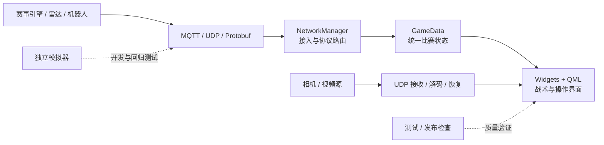

# RM26 Custom Client — RoboMaster 自定义客户端与模拟器

[简体中文](README.md) · [English](README.en.md)

面向 RoboMaster 赛场的自定义操作客户端与战场信息终端。它把赛事状态、机器人、雷达和
多路图传组织成一张可操作的战场态势，并提供独立模拟器，让没有完整场地和实车的开发者也能
调试主要数据链路。

项目由复旦大学星云 EGA 在 2026 赛季的训练和比赛需求中持续迭代。它不是一次性的界面展示，
而是一套围绕操作手注意力、异常降级和可验证开发建立起来的桌面端系统。

> [!IMPORTANT]
> 项目源代码采用 [MIT License](LICENSE)。当前发布快照中的素材已由维护者确认可以公开，
> 具体范围见[素材来源与授权清单](ASSET_LICENSES.md)；第三方名称和标识仍归其权利人所有。

本项目不是 DJI 或 RoboMaster 官方项目。RoboMaster、DJI 及相关标识的权利归其
各自权利人所有。

## 一分钟了解项目

| 这个项目关心什么 | 对应做法 |
| --- | --- |
| 操作手能否看清全局 | 将比赛状态、敌我位置、生命值、关键事件和数据时效性集中到战术视图 |
| 重要信息能否及时到达 | 按角色和紧急程度组织界面、声音与分层提示，减少操作手主动搜索信息的次数 |
| 主视图异常后能否继续操作 | 在已接入备用数据源时提供替代视图，条件恢复后回到战术视图 |
| 没有完整赛场时能否继续开发 | 让模拟器作为独立协议对端，模拟比赛状态、命令和图传，而不是在客户端里埋测试分支 |
| 重构后功能是否仍然可信 | 用客户端测试、模拟器测试和发布检查记录行为证据，再逐步整理边界 |

## 选择你的入口

| 你现在想做什么 | 推荐入口 | 看完能得到什么 |
| --- | --- | --- |
| 先判断项目是否适合自己 | 继续阅读[核心能力](#核心能力)和[已知限制](#当前状态与已知限制) | 项目边界和当前成熟度 |
| 构建并运行客户端 | [快速开始](#快速开始) | 可执行程序和最基本的本地运行环境 |
| 单独体验赛事数据模拟 | [启动模拟器](#3-启动模拟器) | 一个可从浏览器控制的独立协议对端 |
| 读懂架构和关键数据链路 | [学习路径](docs/learning-path.md) | 从消息接入到 QML 展示的源码阅读顺序 |
| 准备提交改动 | [贡献指南](CONTRIBUTING.md) | 开发、测试、安全和提交要求 |

## 为什么做这个项目

比赛现场真正稀缺的不是数据，而是操作手的注意力。传统界面往往要求操作手在多个数据源之间
主动寻找答案；RM26 Custom Client 尝试把信息整理成统一战场态势，再按角色和紧急程度进行
展示、提示与切换：

- **看得全**：融合敌我位置、生命值、比赛状态、关键事件和数据时效性。
- **知道快**：通过战术地图、声音和分层提示，把重要信息主动交给操作手。
- **不断档**：当已经接入可用的备用数据源时，在主视图异常后提供替代视图；实际可用性仍取决于现场链路和配置。

这套系统已经在 2026 赛季的训练和比赛环境中投入使用。这里的“赛场使用”只说明项目经历过
真实工作流，不等同于对延迟、稳定性或比赛成绩的性能背书；可复核的工程结果单独记录在
[验证说明](docs/development/verification.md)中。

## 核心能力

| 能力 | 说明 |
| --- | --- |
| 战术态势 | 全屏战术地图、红蓝方视角、位置与生命值融合、数据过期提示 |
| 操作界面 | Qt Widgets 与 QML 混合界面，支持角色化布局和多分辨率适配 |
| 赛事通信 | MQTT、UDP 与 Protobuf 数据链路，覆盖状态接收和赛事命令发送 |
| 图传链路 | UDP 分片接收、H.264/H.265 解码、面向低延迟的显示链路与异常恢复 |
| 事件提醒 | 基地、前哨、飞镖、能量机关等关键状态的视觉与声音提示 |
| 独立模拟器 | FastAPI、Socket.IO 驱动的 Web 控制台，可模拟比赛状态、命令和图传 |
| 工程验证 | C++/Qt 测试、模拟器测试，以及配置、文档和发布完整性检查 |

## 客户端、模拟器与工具的边界

- `src/` 是正式 Qt/C++ 客户端，负责网络接入、统一比赛状态、视频处理和操作界面。
- `sim/` 是可以独立启动的协议对端，用于在非赛场环境提供可控输入；它不替代真实裁判系统联调。
- `tests/` 和 `tools/release/` 属于开发与发布验证层，不应成为正式客户端业务逻辑的运行时依赖。
- 真实比赛命令和远端现场动作默认不交给自动化工具执行，必须由操作者明确授权。

## 系统概览



组件职责、线程归属和数据流见[架构概览](docs/architecture/overview.md)；协议版本和官方资料来源见
[协议边界](docs/architecture/protocol-boundary.md)。

## 快速开始

下面是仓库当前可复核的最短路径，不假设已经拥有裁判系统或比赛网络。构建完成只证明客户端能够
在本机生成和启动；要复现完整数据流，还需要让客户端与模拟器使用一致的安全测试配置和 MQTT
Broker。仓库已经提供脱敏示例和机器检查；客户端—Broker—模拟器的完整端到端演示仍需在干净
环境复测后补充。

### 1. 准备依赖

最低要求：

- CMake 3.21 或更高版本（使用 Presets）；显式配置方式最低支持 3.16
- 支持 C++17 的编译器
- Qt 6：Core、Concurrent、Widgets、Multimedia、Network、SerialPort、Svg、Quick、QuickWidgets、QuickControls2；构建测试还需要 Test
- Protobuf 与 Abseil
- Paho MQTT C（缺失时 MQTT 功能不启用）
- FFmpeg（可选，缺失时 H.264/H.265 解码功能受限）

macOS 可使用 Homebrew：

```bash
brew install cmake qt@6 protobuf abseil libpaho-mqtt ffmpeg
```

Ubuntu 24.04 的完整依赖列表可参考
[docker/client.Dockerfile](docker/client.Dockerfile)。

### 2. 构建客户端

全新克隆先从公开示例生成本地配置。已有现场配置的团队工作区不要直接覆盖：

```bash
# macOS / Linux
cp config.example.json config.json
python3 tools/release/check_example_config.py config.json

# Windows PowerShell
Copy-Item config.example.json config.json -Force
python tools/release/check_example_config.py config.json
```

示例只连接 `127.0.0.1`，不包含模型、视频或现场身份。`config.json` 是被 Git 忽略的本地文件，
只提交 `config.example.json`。字段、代码回退值、环境变量和配置加载位置见
[配置说明](docs/getting-started/configuration.md)。根目录没有 `config.json` 时，CMake 会从公开示例
生成构建目录中的安全运行配置；需要联调时仍建议先复制并显式核对参数。
Docker 构建也会排除本地配置；使用 Compose 启动前必须先准备根目录 `config.json`，运行时以只读
方式挂载，避免现场参数写进镜像层。

本地联调需要对齐三组值：客户端与模拟器使用同一 MQTT Broker 和机器人 ID；主图传监听
`video.stream_url` 中的 UDP 端口；英雄工业相机复用 MQTT `CustomByteBlock`，不需要第二个 UDP
端口。

使用仓库预设：

```bash
cmake --preset release
cmake --build --preset release
```

也可以显式指定构建目录和选项：

```bash
cmake -S . -B build \
  -DCMAKE_BUILD_TYPE=Release \
  -DBUILD_TESTING=ON \
  -DRM26_ENABLE_DEVTOOLS=OFF
cmake --build build --parallel
```

当前可执行目标沿用历史名称 `RoboMasterClient2025`；这是为避免在开源整理期间改变现场
脚本和打包行为。该名称在 1.x 期间保持兼容，2.0.0 前迁移到规范名称 `RM26CustomClient`。

运行方式：

```bash
# 使用 release preset 时（Linux）
./build/release/RoboMasterClient2025

# 使用显式 build 目录时（Linux）
./build/RoboMasterClient2025

# 使用 release preset 时（macOS）
./build/release/RoboMasterClient2025.app/Contents/MacOS/RoboMasterClient2025

# 使用显式 build 目录时（macOS）
./build/RoboMasterClient2025.app/Contents/MacOS/RoboMasterClient2025

# Windows + Visual Studio 多配置生成器
.\build\release\Release\RoboMasterClient2025.exe

# Windows + Ninja 单配置生成器
.\build\release\RoboMasterClient2025.exe
```

首次运行前请再次检查实际加载的 `config.json`。它只属于本地运行环境；真实 IP、账号、密钥、
抓包或比赛运行记录不得进入提交。

构建成功后应能在对应目录找到 `RoboMasterClient2025` 可执行目标。首次启动如果没有连接数据源，
界面可以打开但不会自然产生比赛状态；这不是模拟器或网络链路已经联通的证据。

### 3. 启动模拟器

模拟器要求 Python 3.11 或更高版本。下面显式使用公开示例中的 MQTT `127.0.0.1:3333` 和机器人
ID `1`；启动脚本会复用现有 Broker，或尝试启动本机 Mosquitto。

```bash
python3 -m venv sim/.venv
source sim/.venv/bin/activate
python -m pip install --upgrade pip
python -m pip install -e sim
./sim/run_sim.sh \
  --no-video \
  --mqtt-host 127.0.0.1 \
  --mqtt-port 3333 \
  --current-robot-id 1
```

启动后访问 `http://127.0.0.1:8000`。参数、端口和独立测试方法见
[模拟器说明](sim/README.md)。模拟主图传时使用自己有权使用的视频执行
`--video-file <path>`，它会向客户端 UDP `3334` 发送 HEVC；第二路工业相机在 Web 控制台中选择
视频并启动，经同一 Broker 的 `CustomByteBlock` 发送 H.264。完整对照见
[两路视频配置](docs/getting-started/configuration.md#两路视频怎样配置)。

## 验证

```bash
# C++ / Qt 测试
cmake --build --preset release
ctest --preset release

# 公开配置与发布工具
python3 tools/release/check_example_config.py
python3 -m unittest discover -s tools/release/tests -p 'test_*.py' -v

# 模拟器独立测试
python3 -m unittest discover -s sim/tests -t sim -p 'test_*.py' -v
node --test sim/tests/test_map_geometry.js

# 文档、资源与发布快照检查
python3 tools/release/check_docs.py
python3 tools/release/check_runtime_resources.py
python3 tools/release/check_public_readiness.py
```

各类改动的必跑项、最近一次发布候选验证和未覆盖范围见
[验证说明](docs/development/verification.md)。测试失败时请保留完整命令、平台、构建选项和日志，
不要只记录“本机不通过”。

模拟器已提供独立的 Python 赛事推进测试和 JavaScript 地图坐标测试，并接入 Quality CI。
这些测试不连接现场环境；涉及 Broker、视频流和客户端显示的改动仍需完成隔离环境或端到端验证。

### 最近一次发布候选验证

2026-08-26 在 macOS 发布候选快照和 GitHub Actions Ubuntu 24.04 环境完成了以下复核。完整命令、环境和适用边界见
[验证说明](docs/development/verification.md)：

| 检查 | 已提交快照结果 |
| --- | --- |
| Release 配置与编译 | 通过 |
| CTest | 27/27 通过 |
| 发布工具单测 | 118/118 通过 |
| 模拟器 Python / JavaScript 测试 | 28/28、3/3 通过 |
| 模拟器 Protobuf 兼容性检查 | 通过 |
| Ubuntu 24.04 Quality CI | 仓库检查、QML、原生构建与 CTest 通过 |

这份基线没有覆盖 Windows、Linux 桌面实机长期运行、真实裁判系统、真实网络抖动或完整赛场动作；
Ubuntu 24.04 当前覆盖的是 CI 构建和自动测试。采访、截图和比赛使用经历也不会代替这些验证。

## 可以从项目中学习什么

项目保留的不只是最终界面，也包括真实系统如何逐步形成边界和证据：

- **端到端状态链路**：一条 MQTT/Protobuf 消息如何进入网络层、写入 `GameData`，再驱动
  Widgets 与 QML 更新。
- **Qt 混合桌面架构**：主窗口、原生控件和 QML 战术视图如何分工，以及线程和生命周期怎样收口。
- **低延迟视频链路**：UDP 分片、组帧、FFmpeg 解码、异常恢复和界面显示之间如何协作。
- **可控的无实车开发**：独立模拟器、自动化测试、协议兼容性检查和人工授权边界如何降低回归风险。

按目标阅读的源码入口、概念文档和练习建议见[学习路径](docs/learning-path.md)。

## 仓库结构

```text
.
├── src/                  # 正式 Qt/C++ 客户端
│   ├── core/             # 比赛状态与领域数据
│   ├── network/          # MQTT、UDP、协议与视频链路
│   ├── ui/               # 主窗口和应用编排
│   ├── widgets/          # 原生 Qt 控件
│   ├── qml/              # 战术地图和交互面板
│   └── devhooks/         # 可选开发观测接口
├── sim/                  # 独立 Python/Web 模拟器
├── tests/                # C++/Qt 测试
├── tools/release/        # 配置、资源、文档与发布检查
├── docs/                 # 用户、架构、协议和维护者文档
├── resources/            # 客户端运行资源，公开范围见 ASSET_LICENSES.md
└── CMakeLists.txt
```

文档导航见 [docs/README.md](docs/README.md)。

## 贡献

欢迎提交可复现的问题、测试和小步改进。涉及协议、网络、图传或比赛命令的修改，必须同时
提供行为证据和回归测试；目录迁移、接口改写与功能变化应拆成不同提交。

开始前请阅读：

- [贡献指南](CONTRIBUTING.md)
- [使用与问题支持](SUPPORT.md)
- [安全策略](SECURITY.md)
- [行为准则](CODE_OF_CONDUCT.md)
- [路线图](ROADMAP.md)
- [架构决策](docs/decisions/README.md)

项目采用 MIT License。提交贡献即表示你有权提供相关代码、文档或素材，并同意维护者按本项目
许可证发布；第三方内容仍需保留其原始许可证和署名要求。

## 当前状态与已知限制

当前仓库已完成首个源码开源版本的工程整理、授权登记和发布检查。仍然存在的平台与发行限制会
继续明确记录：

首个公开版本只计划提供源码归档，需要使用者按本文安装依赖并构建；目前不提供经过验收的 macOS、
Windows、Linux 安装包或模拟器 wheel。

| 事项 | 当前状态 | 对使用者的影响 |
| --- | --- | --- |
| 项目许可证 | MIT | 源代码可按 [LICENSE](LICENSE) 使用、修改和再分发 |
| 发行方式 | 仅源码归档 | 不提供下载即用的客户端安装包或模拟器 wheel |
| 素材权属 | 当前 10 组快照已批准 | 仅覆盖素材台账登记的固定快照，变更后必须重新复核 |
| 公开历史 | 首次发布采用审阅后的根快照 | 内部研发历史、任务记录和本地日志不随仓库发布 |
| 模拟器公开测试 | Python 与 JavaScript 测试已提供 | Broker、视频和客户端显示仍需单独完成端到端验证 |
| 平台与现场验证 | 仍需补齐 | 已提交基线不能外推到所有系统、网络和比赛环境 |

发布模式和验收条件见[开源发行与打包契约](docs/maintainers/packaging-contract.md)，素材状态见
[ASSET_LICENSES.md](ASSET_LICENSES.md)。如果只想了解设计和代码，可以从[文档首页](docs/README.md)
继续；如果准备参与整理或提交修复，请先阅读贡献与安全说明。
