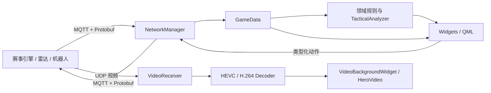

# 组件职责与数据流

本文从“数据怎样进入客户端、在哪里变成状态、最后由谁展示或发回赛事端”的角度介绍代码。
它适合第一次阅读项目，也可作为协议和界面改动时的定位索引。

协议字段、消息编号和限频要求仍以当赛季官方资料以及仓库中的
[`protocol_manifest.json`](../../src/network/proto/protocol_manifest.json) 为准。本文只描述当前
代码的职责和调用方向，不替代协议定义。

## 运行时主链路



这条链路有三条不能打破的边界：

1. `src/network` 负责接入、解析、序列化和路由，不决定界面布局。
2. `src/core` 保存比赛状态并生成可供界面读取的投影，不建立网络连接。
3. QML 只读取已公开的 Qt 属性并调用类型化动作，不解释原始 Protobuf，也不直接发布 topic。

## 主要组件

| 组件 | 当前职责 | 不应承担的职责 |
| --- | --- | --- |
| [`GameData`](../../src/core/GameData.h) | 比赛阶段、单位状态、位置、事件、Buff、战术页面所需投影 | MQTT 连接、窗口生命周期、页面布局 |
| [`TacticalAnalyzer`](../../src/core/TacticalAnalyzer.h) | 从 `GameData` 生成目标排序、资源摘要、事件和建议 | 伪造协议事实、直接发送赛事命令 |
| [`NetworkManager`](../../src/network/NetworkManager.h) | topic 订阅与路由、Protobuf 编解码、类型化上行动作 | QML 页面编排、战术展示规则 |
| [`MqttManager`](../../src/network/MqttManager.h) | MQTT 连接、订阅、发布和重连生命周期 | 比赛状态的第二份缓存 |
| [`VideoReceiver`](../../src/network/VideoReceiver.h) | UDP 收包、分片重组、连续性统计和解码器调度 | 页面切换与战术决策 |
| [`MainWindow`](../../src/ui/MainWindow.h) | 应用组合、窗口与页面生命周期、信号槽接线、输入分发 | 重复实现协议字段语义 |
| [`VideoBackgroundWidget`](../../src/widgets/VideoBackgroundWidget.h) | 主图传帧率控制与绘制 | 网络连接和协议解析 |
| [`src/qml`](../../src/qml/) | 状态展示、布局和用户交互 | 原始 payload 解析、Broker 配置 |

`MainWindow` 目前仍是较大的组合根，`GameData` 与 `NetworkManager` 也保留了一些历史接口。
这属于渐进整理中的结构债务。新增功能应优先沿现有边界补齐测试，不在一次改动中同时重写
协议、状态和界面。

## 下行状态怎样进入界面

下行 MQTT 消息的共同路径是：

```text
MQTT topic
  -> MqttManager 收到 payload
  -> NetworkManager::processMqttMessage 解析并路由
  -> GameData 对应 update 方法更新统一状态
  -> Qt 信号 / Q_PROPERTY 通知
  -> Widgets 或 QML 重新读取展示数据
```

常用消息与代码落点如下。表中只列定位信息；是否完整支持某一消息，应同时检查 schema、
实现和测试。

| 消息 | 状态落点 | 典型使用方 |
| --- | --- | --- |
| `GameStatus` | `GameData::updateGameStatus` | 比赛阶段、倒计时、比分和暂停状态 |
| `GlobalUnitStatus` | `GameData::updateGlobalUnitStatus` | 双方单位、基地、前哨站和全局统计 |
| `GlobalLogisticsStatus` | `GameData::updateGlobalLogisticsStatus` | 后勤与经济信息 |
| `RobotStaticStatus` | `GameData::updateRobotStaticStatus` | 机器人类型、等级、上限和连接信息 |
| `RobotDynamicStatus` | `GameData::updateRobotDynamicStatus` | 当前操控机器人状态和 HUD |
| `RobotPosition`、`RadarInfoToClient` | `GameData` 位置与雷达投影 | 小地图、战术地图和目标排序 |
| `Event`、`PenaltyInfo`、`RobotRespawnStatus` | `GameData` 事件与状态处理 | 弹窗、复活、判罚和战术事件 |
| `Buff`、`RuneStatusSync` | 对应 `GameData::update*` 方法 | Buff 面板和能量机关交互 |
| `TechCoreMotionStateSync` | `GameData::updateTechCoreMotionStateSync` | 工程兑换流程状态 |
| `CustomByteBlock` | 自定义数据解析或 H.264 视频分流 | 自定义状态面板与英雄图传 |

同一状态只能有一个权威落点。界面需要派生值时，应从 `GameData` 的公开字段计算，或把可复用
规则放入 `src/core`，不要在多个 QML 文件里分别维护同一种比赛含义。

## 上行动作怎样发出

上行链路从有类型的界面动作开始：

```text
用户输入 / QML 信号
  -> MainWindow 或策略类完成状态检查
  -> NetworkManager::send* 构造 Protobuf
  -> NetworkManager 内部限频与连接检查
  -> MqttManager::publish
```

| 动作 | 当前发送入口 | 主要约束 |
| --- | --- | --- |
| 键鼠控制 | `sendKeyboardMouseControl` | 登录和页面状态检查、协议限频、中性帧处理 |
| 通用命令 | `sendCommonCommand` | 命令参数语义和网络层限频 |
| 工程兑换 | `sendAssemblyCommand` | 操作类型、难度和同步状态 |
| 空中支援 | `sendAirSupportCommand` | 指令语义、可用状态和限频 |
| 地图标记 | `sendMapClickInfo` | 坐标、目标 ID、标记类型和限频 |
| 性能体系选择 | `sendRobotPerformanceSelection` | 当前机器人身份和协议枚举 |
| 英雄部署模式 | `sendHeroDeployMode` | 模式状态和协议枚举 |
| 能量机关激活 | `sendRuneActivate` | 页面交互确认和协议状态 |

新增动作时，先在 C++ 中提供清晰的类型化接口，再由 QML 调用。不要为了少写一层代码而向
QML 暴露任意 topic、任意 payload 或通用 publish 接口。

## 两路视频数据流

### 主图传

```text
UDP 图传分片
  -> VideoReceiver::processPacket
  -> 分片校验与 assembleFrame
  -> HevcDecoder
  -> VideoReceiver::imageReceivedTimed
  -> VideoBackgroundWidget::onTimedImageReceived
  -> schedulePresent
  -> paintEvent
```

主图传链路以帧 ID 和分片信息跟踪连续性。收包、组帧、解码和绘制是不同阶段，排障时应分别
判断，不能把“端口收到数据”等同于“界面已经显示有效画面”。

### 自定义 H.264 图传

```text
CustomByteBlock 视频负载
  -> NetworkManager::customVideoPayloadReceived
  -> VideoReceiver::feedH264Frame
  -> H264Decoder
  -> VideoReceiver::imageReceivedH264
  -> GameData::heroFrameUpdated
  -> HeroVideoWidget / QML 图像源
```

这条链路复用现有解码结果。战术页面只选择如何摆放画面，不重新解析自定义通道，也不另外
维护一套 H.264 解码器。

## 界面定位索引

| 界面区域 | 主文件 | 主要数据来源 |
| --- | --- | --- |
| 应用窗口与页面切换 | [`MainWindow.cpp`](../../src/ui/MainWindow.cpp) | `GameData`、`NetworkManager`、页面状态策略 |
| 中央 HUD | [`CentralAimingHUD.qml`](../../src/qml/CentralAimingHUD.qml) | 当前机器人状态、比赛阶段 |
| 小地图 | [`MiniMap.qml`](../../src/qml/MiniMap.qml) | 机器人位置、雷达信息、地图标记 |
| 兑换面板 | [`ExchangePanel.qml`](../../src/qml/ExchangePanel.qml) | 后勤状态、同步状态和类型化命令 |
| 部署模式 | [`DeployModePanel.qml`](../../src/qml/DeployModePanel.qml) | 部署模式状态和命令 |
| 自定义叠加层 | [`CustomUI`](../../src/qml/CustomUI/) | `CustomByteBlock` 解析后的状态 |
| 战术指挥页 | [`TacticalCommandPage.qml`](../../src/qml/Tactical/TacticalCommandPage.qml) | `TacticalAnalyzer` 投影、地图与视频状态 |
| 系统与比赛事件 | [`MessageNotificationPanel.qml`](../../src/qml/MessageNotificationPanel.qml)、[`EventMessagePanel.qml`](../../src/qml/EventMessagePanel.qml) | `GameData` 事件投影 |

对齐官方界面时，先从[官方资料索引](../references/official-materials.md)确认参考版本，再定位主文件
和数据源。若所需字段尚未进入 `GameData`，应先补协议和领域链路，不能先在页面里伪造一个
看似可用的状态。

## 修改一条数据链路时

至少回答以下问题：

1. 数据来自哪个官方消息或项目自定义扩展？
2. transport、方向、字段 presence 和限频是什么？
3. `NetworkManager` 在哪里解析或发送？
4. 权威状态落到 `GameData` 的哪个字段和信号？
5. 哪个 Widget 或 QML 页面消费它？
6. 模拟器是否需要同步生成或接收该消息？
7. 用什么测试证明客户端、模拟器和字节契约没有漂移？

更高层的依赖方向见[系统架构概览](overview.md)，协议判定顺序见
[协议边界](protocol-boundary.md)，验证方式见[测试与质量门](testing.md)。
