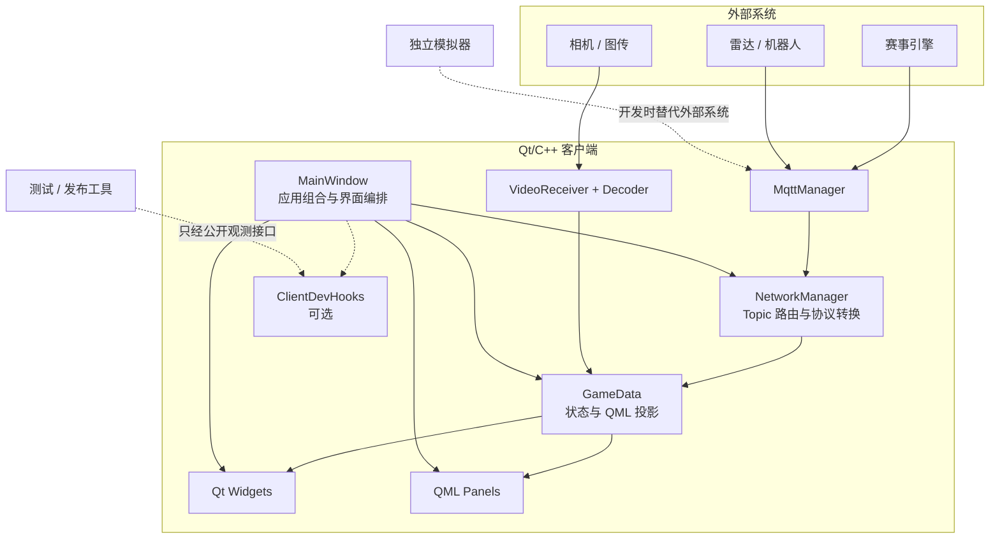
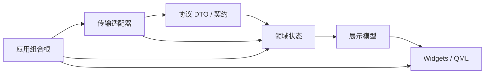

# 系统架构概览

本文说明正式客户端、独立模拟器和开发验证工具的代码边界，并记录渐进式演进方向。

## 设计目标

RM26 Custom Client 的架构设计优先保证比赛现场稳定。内部调整遵循四条原则：

1. 先用测试和运行证据固定现有行为，再改变内部实现。
2. 协议、领域状态、界面展示和开发工具各有清晰边界。
3. 模拟器是客户端的独立协议对端，不进入生产客户端依赖图。
4. 现场动作默认拒绝，开发工具不能绕过人工授权。

## 运行架构



图中也保留了现有耦合：`MainWindow`、`GameData` 和 `NetworkManager` 承担多项职责；根 CMake
又将大部分生产代码合入同一个静态库，因此链接阶段尚不能检查这些逻辑边界。

## 模块职责

| 目录 | 职责 | 不应承担的职责 |
| --- | --- | --- |
| `src/core` | 比赛状态、领域数据、状态投影 | UI 生命周期、网络连接、工具脚本 |
| `src/network` | MQTT/UDP 接入、协议解析、视频收包与解码 | QML 页面编排、比赛策略展示 |
| `src/ui` | 应用组合、窗口与页面生命周期 | 协议字段解析、后台网络线程实现 |
| `src/widgets` | 原生 Qt 控件与视频承载 | 传输连接管理 |
| `src/qml` | 战术地图、状态面板和交互展示 | 原始 payload 解析、无类型网络调用 |
| `src/devhooks` | 可选健康检查、快照和受限动作 | 正式业务规则、默认开启的控制入口 |
| `sim` | 独立赛事协议对端和开发控制台 | 生产客户端内置逻辑 |
| `tests` | C++/Qt 回归测试 | 正式客户端运行时依赖 |
| `tools/release` | 配置、资源、文档和发布检查 | 生产协议或 UI 的第二套实现 |

## 历史兼容模块

源码树保留了一处需要说明的兼容模块：

- `src/simulator/ProtocolSimulator.*` 会编入客户端库，并由 `MainWindow` 创建和启动。它提供进程内兼容能力，独立的 `sim/` 承担新模拟功能。迁移或删除该模块前，应先补运行开关和依赖证据。

公开目录不承诺稳定 API。维护者应先收敛调用方和测试，再移动这些兼容模块。

## 允许的依赖方向



- 领域层不得依赖 QML、Widgets 或开发工具。
- 网络层不得创建页面或处理布局。
- QML 可以读取展示模型，并通过有类型的 action facade 发起动作；不得直接处理原始协议。
- Harness 和模拟器只能通过公开接口与客户端交互，不能反向成为生产依赖。

`GameData` 的公开接口暴露了部分 Protobuf 类型，QML 也保留了直接调用 `NetworkManager` 的
历史路径。这些迁移债务适合分步处理，避免在一次提交中整体改写。

## 目标编译边界

行为基线稳定后，再逐步把单一 `RoboMasterClientLib` 拆为：

```text
rm26_protocol       协议生成代码与稳定 DTO
rm26_domain         不依赖 UI 的比赛状态和规则
rm26_transport      MQTT、UDP 与消息路由
rm26_video          收包、组帧、解码与恢复
rm26_presentation   Qt 展示模型和有类型动作门面
rm26_app            窗口、QML、资源与应用组合
```

这些 target 用于在构建阶段暴露循环依赖、无意公开的头文件和平台依赖。每形成一个新边界，
都应先补覆盖该边界的回归测试。

## 演进顺序

1. **冻结基线**：构建、测试、协议样本、关键界面和现场链路都有可复现证据。
2. **修安全边界**：现场动作授权、MQTT 生命周期、视频线程退出和配置脱敏。
3. **提取逻辑缝**：从巨型类中逐个提取纯逻辑、路由器和服务，保留原有 facade。
4. **形成编译边界**：用 CMake target 固化依赖方向，再迁移目录。
5. **发布公开镜像**：只包含权属明确、经过历史扫描的公开白名单内容。

渐进式整理原则见[ADR-0001：增量加固](../decisions/0001-incremental-hardening.md)，重大选择
统一记录在[架构决策目录](../decisions/README.md)。

## 修改架构时的最低证据

- 说明行为是否变化；若不变化，给出保护行为的测试。
- 列出新增和移除的依赖方向。
- 协议改动提供字段、方向、频率和双端兼容证据。
- 线程或对象生命周期改动提供退出、重连和快速切换用例。
- 涉及 QML 布局时覆盖常用分辨率与缩放比例。
- 涉及现场动作时证明默认路径不会发送真实命令。

继续阅读：

- [组件职责与数据流](data-flow.md)：沿消息、状态、页面和视频链路定位代码；
- [传输接入与链路诊断](transport-integration.md)：区分协议、传输、部署和观测证据；
- [战术分析](tactical-analysis.md)：区分当前能力与时间线持久化方向。
