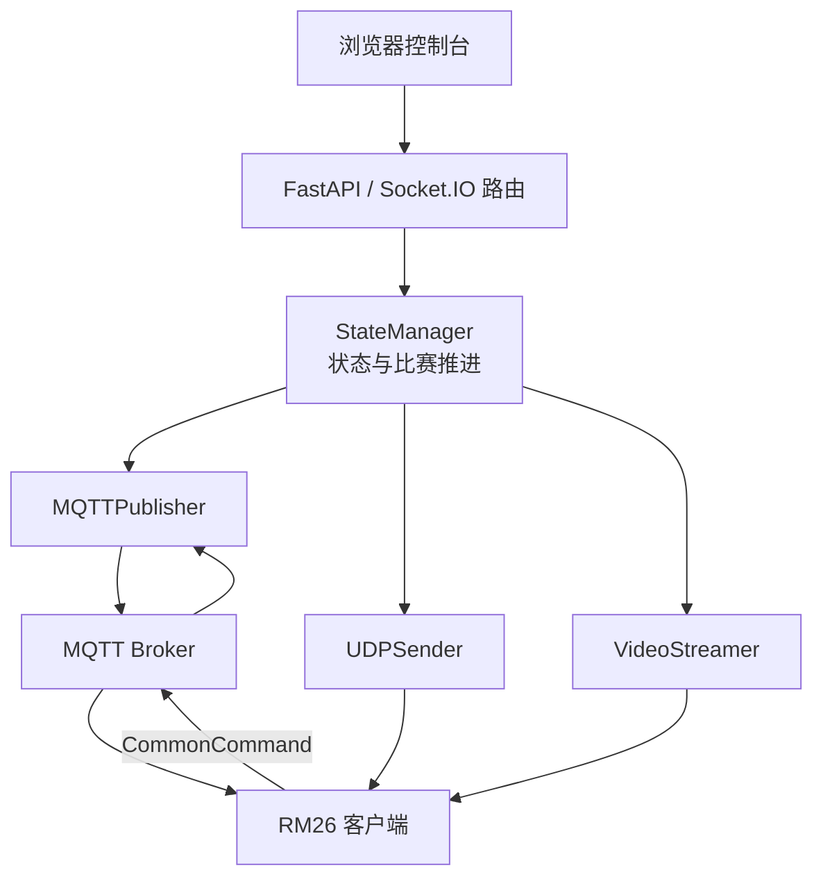
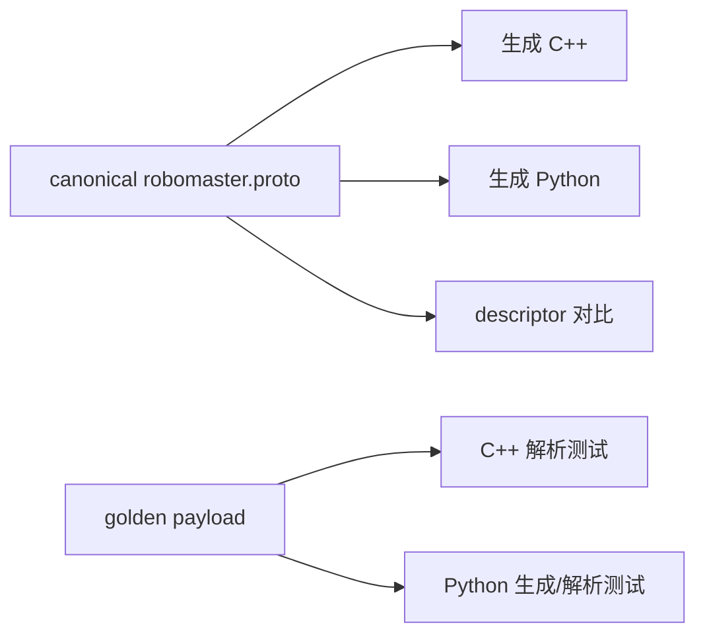

# 模拟器架构

## 定位

`sim/` 用来在没有赛事引擎、雷达和机器人硬件的环境中复现协议交互。它与正式客户端
通过 MQTT、UDP 和视频链路通信，是一个独立进程，也是一组可自动化验证的测试设施。

模拟器不应直接修改客户端内存，不应被链接进生产客户端，也不应成为协议的新真相源。

## 当前组件



- `server/main.py`：当前应用入口、HTTP/Socket.IO 路由和组件装配。
- `server/state_manager.py`：模拟状态、事件队列和状态变更。
- `server/mqtt_publisher.py`：状态发布与客户端上行命令接收。
- `server/udp_sender.py`：UDP 兼容链路。
- `server/video_streamer.py`：文件或相机视频输入。
- `server/static/`：浏览器控制台。

`server.py` 是兼容旧命令的转发入口，不应继续增加业务逻辑。

## 已知结构债务

### 应用导入即产生副作用

当前入口在模块导入阶段解析命令行、创建连接并启动部分后台工作。目标是引入
`create_app(settings, dependencies)` 和统一 lifespan，使单元测试能在不访问网络的情况下
导入应用，也能确定性关闭所有线程和连接。

### 命令语义重复

Web 路由和 MQTT 回调都可能直接修改 `StateManager` 内部结构。目标是提取统一的
`ApplicationCommandService`：各传输层只负责校验输入和返回结果，比赛规则只实现一次。

### 状态与时钟职责过重

`StateManager` 同时承担状态存储、比赛阶段推进和部分规则判断。迁移时先用固定时钟和状态
迁移测试锁住现有行为，再把比赛时钟与阶段规则提取到领域服务；入口和 transport 不直接
复制这些规则。

### 协议生成边界

生产客户端与模拟器共用 `src/network/proto/robomaster.proto`。Python 生成代码提交到仓库，
并由 CI 临时生成 descriptor 与 canonical schema 比对：



模拟器目录不再保留第二份手工 schema。协议变更需要同时更新 descriptor、Python/C++ wire
golden 和相关行为测试；生成及验证命令见
[Protobuf 单一 Schema 维护说明](../maintainers/protocol-convergence-plan.md)。

### UDP 帧格式并存

模拟器保留简化帧与完整 CRC 帧两种路径。清理前必须分别保存 golden frame，并确认哪些
入口仍被客户端或现场脚本使用。未知使用方的兼容代码不能凭“看起来过时”删除。

## 目标目录边界

保持外部 API 和事件名不变，内部逐步形成：

```text
sim/server/
├── api/             # HTTP 与 Socket.IO 输入校验
├── application/     # 用例与统一命令服务
├── domain/          # 比赛状态和规则，不依赖网络
├── transports/      # MQTT、UDP 和视频适配器
├── web/             # 静态控制台资源
├── app.py           # create_app 与生命周期
└── main.py          # 参数解析和进程入口
```

旧模块先保留兼容转发，等调用点、测试和脚本全部迁移后再删除。

## 安全边界

- 默认运行只允许本地开发配置。
- 任何可能向真实赛事引擎或客户端发送动作的场景都必须显式授权。
- 远程地址、现场 profile、账号和运行证据不能进入公开仓库。
- Web 输入、MQTT 输入和上传文件都要按不可信数据处理。

## 验证矩阵

| 修改范围 | 最低验证 |
| --- | --- |
| 比赛状态或时钟 | Python 领域单测、阶段边界与暂停/恢复用例 |
| Web/Socket.IO | 应用工厂测试、路由契约、错误输入与 shutdown |
| MQTT | topic、QoS、机器人 ID、双向命令和重连测试 |
| Protobuf | descriptor 对比、Python/C++ golden payload |
| UDP | 两种帧格式的字节级 fixture 与 CRC 用例 |
| 地图 | Node 几何测试和常用分辨率 |
| 视频 | 固定短样本、启动/停止和无输入退出测试 |

安装和启动方法见 [sim/README.md](../../sim/README.md)。
