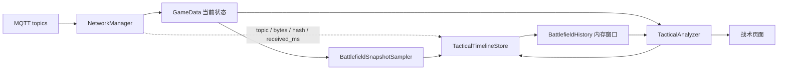

# 战术分析的数据边界与演进方向

本文说明战术指挥页面依赖哪些真实数据、哪些内容属于本地推导，以及持久化战场时间线的设计
方向。现有能力和规划功能分开记录。

## 现有能力

### 状态来源

[`NetworkManager`](../../src/network/NetworkManager.cpp) 订阅比赛状态、单位状态、后勤、事件、
机器人状态、位置、雷达、Buff、判罚和多种同步 topic，并把解析结果写入
[`GameData`](../../src/core/GameData.h)。`GameData` 是战术页面读取当前比赛状态的统一入口。

[`TacticalAnalyzer`](../../src/core/TacticalAnalyzer.h) 由 `MainWindow` 创建，默认按短周期读取
`GameData`，生成：

- 比赛与资源摘要；
- 关键事件；
- 敌方目标排序；
- 雷达和地图投影；
- 己方机器人状态与执行信息；
- 当前主建议和有限的趋势数据；
- 主图传与辅助图传的页面投影。

这些结果通过 Qt 属性提供给
[`TacticalCommandPage.qml`](../../src/qml/Tactical/TacticalCommandPage.qml) 及其子组件。QML
负责布局和展示，不重新解释协议消息。

### 两类数据必须区分

| 数据 | 来源 | 在界面中的含义 |
| --- | --- | --- |
| 比赛阶段、比分、倒计时 | `GameStatus` | 协议事实 |
| 基地、前哨站、机器人血量和全局统计 | `GlobalUnitStatus` 等 | 协议事实，受消息可见范围限制 |
| 当前操控机器人动态状态 | `RobotDynamicStatus` | 当前机器人事实，不能外推为全队状态 |
| 位置和雷达高亮 | `RobotPosition`、`RadarInfoToClient` | 带更新时间的数据，过期后应标为 stale |
| Buff、判罚和关键事件 | 对应同步消息或事件 | 协议事实或明确的事件映射 |
| 威胁分数、目标排序、资源差 | `TacticalAnalyzer` 计算 | 本地推导，应能说明输入和规则 |
| 主建议、窗口判断 | 多项状态组合 | 本地建议，不是赛事端命令 |
| 链路延迟和灰屏率 | 客户端运行指标 | 只有接入真实测量后才可展示为数值 |

协议没有提供的数据应保持 unknown；通过现有字段估算的结果应标为 estimated，并降低建议的
置信度。视觉上“有一条曲线”不能被当作已经采集到真实历史。

### 地图与两路画面

战术地图使用 QRC 中的红蓝视角底图：

```text
qrc:/images/minimap_bg_red_left.png
qrc:/images/minimap_bg_blue_left.png
```

坐标先经过 [`MapCoordinateMapper`](../../src/core/MapCoordinateMapper.h) 归一化，再由 QML 按
组件尺寸绘制。没有经过正式锚点校准的数据不能标为精确位置。

主 HEVC 图传由 `VideoReceiver` 和 `VideoBackgroundWidget` 处理；自定义 H.264 图传沿
`CustomByteBlock -> H264Decoder -> GameData::heroFrameUpdated` 进入辅助画面。战术页面只切换
布局和可见性，不应重启接收链路或重复解码。

## 规划功能

仓库目前没有 `TacticalTimelineStore`、`BattlefieldSnapshotSampler` 或 `BattlefieldHistory`，也没有
把战术状态持续写入 JSONL 或数据库。现有少量趋势主要保存在进程内，应用重启后不会恢复；
部分 QML 组件仍有用于无数据展示的静态 fallback 曲线。

源码尚未提供以下能力：

- 跨进程或跨场次的战场历史；
- 可复核的完整趋势曲线；
- 赛后按时间线重放；
- 每条战术建议与后续结果的自动关联；
- 仅凭客户端日志得到机器人到界面的完整端到端时延。

## 建议的时间线设计

战术分析需要同时处理“当前状态”和“过去一段时间”。建议保持 `GameData` 作为当前状态中心，
另建只追加的轻量时间线：



这张图描述设计方向，图中的三个时间线组件尚未进入源码。

### 组件职责建议

| 组件 | 职责 |
| --- | --- |
| `TacticalTimelineStore` | 追加事件、快照、派生指标和命令；负责滚动、flush 和保留期限 |
| `BattlefieldSnapshotSampler` | 从 `GameData` 生成规范化快照，低频采样并在关键事件时补采样 |
| `BattlefieldHistory` | 维护最近一段时间的内存窗口，提供趋势、差分、last-seen 和 stale 判断 |

它们应放在 `src/core` 或后续独立的领域 target 中。不要把历史状态放入 QML，不要让
`NetworkManager` 承担战术规则，也不要让开发工具成为正式运行依赖。

### 为什么第一版适合 JSONL

第一版可采用按场次滚动的 append-only JSONL：

```text
tmp/tactical/<session>/
  manifest.json
  events.jsonl
  samples.jsonl
  derived.jsonl
  commands.jsonl
```

理由是比赛数据天然按时间追加，QtCore 即可写入，单行损坏不会影响后续内容，也方便用 Python
或 `jq` 做赛后检查。需要跨场次复杂查询时，可以再构建 SQLite 离线索引；不必一开始就把
QtSql 和数据库驱动加入现场运行依赖。

建议每行至少包含：

- 本地时间、回合和比赛时间；
- `source=protocol|derived|local_command|video_runtime`；
- 记录类型和稳定版本号；
- 规范化字段或必要摘要；
- 对估算值使用 `estimated=true` 或置信度；
- 可用于对齐的 topic、帧 ID、命令类型或相关 ID。

高频视频 payload 和未经脱敏的完整 Protobuf 不应直接写盘。对 MQTT 观测，可先记录 topic、
字节数、摘要和接收时刻；状态快照按固定低频采样，并在阶段变化、单位状态变化或关键事件时
补一条。

## 分阶段落地

### 第一阶段：只记录，不影响界面决策

- 建立带版本号的 manifest 和 JSONL 写入器；
- 记录必要的 MQTT 元数据、规范化状态快照和视频统计摘要；
- 覆盖异常退出、MQTT 重连、文件滚动和磁盘空间限制；
- 默认关闭或明确告知保存位置，不收集现场凭据和原始视频。

第一阶段先验证记录可靠性及其对客户端帧率的影响；复杂预测放到后续阶段。

### 第二阶段：使用真实历史

- 让 `BattlefieldHistory` 提供实际趋势数组和 last-seen 状态；
- 无真实样本时明确显示“等待数据”，不画容易被误解的模拟曲线；
- 把链路指标接入真实运行统计，没有发送端时间戳时避免使用“端到端延迟”表述；
- 测试应用重启、跨阶段和不完整记录下的恢复行为。

### 第三阶段：复盘与建议追溯

- 从历史派生残血窗口、推进窗口、基地风险和长时间不可见等事件；
- 记录主建议变化、输入字段、规则版本、持续时间和置信度；
- 记录类型化命令的发起、限频、本地发布结果和可获得的回执；
- 导出按回合组织的 JSON 或 Markdown 复盘。

每条建议都应能追溯到当时的状态快照和规则版本，不能只保存最终一句文字。

## 战术命令安全边界

当前战术页面应以信息展示和建议为主。后续即使增加单机器人或全队指令，也必须满足：

1. QML 不直接 publish，也不拼接任意 payload。
2. 指令经过正式发送层、状态检查和协议限频。
3. 地图点击先形成本地关注点；真实下发需要显式启用和确认。
4. 默认配置不允许真实战术命令。
5. 每次真实发送保留结构化记录，并明确本地成功不等于机器人已执行。
6. 模拟器环境和赛事环境使用不同配置，不能因为测试脚本运行而自动扩大授权。

## 实现前的最低验证

- 用固定时钟测试采样频率、阶段切换和事件补采样。
- 用临时目录测试文件滚动、损坏行、磁盘不足和重启恢复。
- 证明视频 payload 不会被写入普通时间线。
- 证明记录开关关闭时不创建文件、不改变战术页面行为。
- 对趋势和建议提供确定性输入与期望输出。
- 做至少一轮带视频和高频 MQTT 的运行测试，观察 UI、解码和写盘开销。
- 检查生成目录仍被 Git 忽略，公开 fixture 已脱敏且权属明确。

现有组件之间的调用关系见[组件职责与数据流](data-flow.md)，链路指标的解释边界见
[传输接入与链路诊断](transport-integration.md)。
