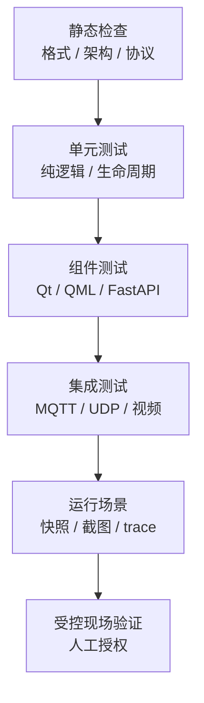

# 测试与质量门

## 原则

测试体系以赛场行为回归为核心。发布候选需要同时覆盖静态结构、纯逻辑、协议字节、模拟器
对端和真实运行链路。

## 分层验证



静态检查、可重复测试和现场验证覆盖不同风险，三类结论不能相互替代。

## 常用命令

### C++ 与 Qt

日常开发可使用仓库预设：

```bash
cmake --preset dev
cmake --build --preset dev
ctest --preset dev
```

需要逐项控制时使用显式参数：

```bash
cmake -S . -B build -DBUILD_TESTING=ON -DRM26_ENABLE_DEVTOOLS=OFF
cmake --build build --parallel
ctest --test-dir build --output-on-failure
```

测试文件存在不代表已经被 CTest 注册。新增测试后应同时检查：

```bash
ctest --test-dir build --show-only
```

### 模拟器

模拟器包含 Python 与 JavaScript 独立测试。修改规则时，应把对应的用例与 fixture 一同提交：

```bash
python3 -m unittest discover -s sim/tests -t sim -p 'test_*.py' -v
node --test sim/tests/test_map_geometry.js
```

Protobuf 生成代码的版本契约已有独立门禁：

```bash
python3 tools/release/check_sim_protobuf_runtime.py
```

该检查会同时核对 `pyproject.toml`、`requirements.txt`、pb2 声明的最低版本，
并真实导入当前 Python 环境的 runtime 和生成模块。

### 发布与协议兼容性检查

```bash
python3 tools/release/check_sim_protobuf_runtime.py
python3 tools/release/check_docs.py
python3 tools/release/check_runtime_resources.py
python3 tools/release/check_public_readiness.py
```

### Ubuntu CI

Quality 工作流使用独立 `ci` Preset，不复用开发者本地的 `build/release`：

```bash
cmake --preset ci
cmake --build --preset ci
ctest --preset ci --no-tests=error --timeout 120
```

该 Preset 固定 Ninja、`build/ci`、ccache 和四路构建。Ubuntu 任务还统一使用 offscreen 与软件
渲染，并安装客户端实际 import 的 QML 模块。普通本地开发继续使用 `dev` 或 `release`，不需要
为了 CI 改变生成器。

工作流文件和本地命令通过不等于远端 Linux 已验证。首次推送后仍需保存真实 Actions 运行记录；
模拟器测试和发布检查均由 Quality 工作流执行。

## 基线记录

基线必须与一个明确提交和一组构建选项绑定，至少包含：

- Git commit、平台、编译器、Qt、Protobuf 和 FFmpeg 版本。
- CMake 配置参数与构建目录是否为全新目录。
- CTest 注册数量、通过数量和每项失败的完整日志。
- 模拟器 Python/JavaScript 测试结果。
- 协议版本和使用的 fixture。

已有失败不能被悄悄改成跳过或 `continue-on-error`。应先判断是产品行为回归、测试预期
过时、环境依赖还是不稳定用例，再用独立提交处理。

## 按修改范围选测试

| 修改范围 | 必跑项 |
| --- | --- |
| 领域状态 | 对应 C++ 单测、协议 fixture、受影响 QML 投影测试 |
| MQTT/UDP | 路由、序列化、重连、快速停止和错误输入 |
| 视频 | 分片、组帧、解码失败、流恢复和线程退出 |
| QML 布局 | 组件测试、缩放矩阵、截图或几何证据 |
| 模拟器规则 | Python 单测、Web/MQTT 两入口一致性 |
| CMake/目录 | 全新配置、全量构建、CTest 注册清单、发布快照检查 |
| 发布工具 | Python 单测、配置与资源检查、错误路径输出 |

## 提交前检查

1. `git diff --check` 无新增空白错误。
2. 只提交本任务文件，工作区其他改动保持原样。
3. 新增测试已经由 CTest 执行并产生结果。
4. 文档中的命令在仓库根目录可直接执行。
5. 失败项写清现象、原因判断和下一步，不把未知失败包装成通过。

准备公开源码归档时，还应按[公开发布预检说明](../../tools/release/README.md)执行索引快照审计。
