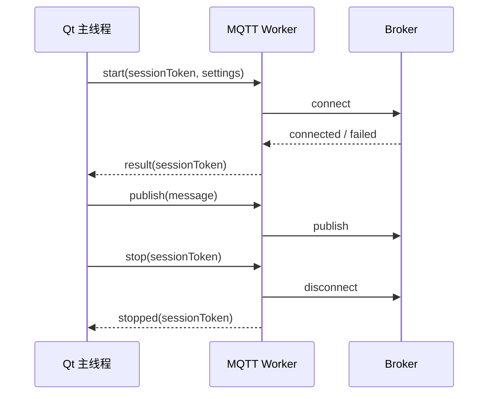

# 线程与对象生命周期

这份文档记录当前并发边界和必须保持的退出约束。它既是重构依据，也是网络、视频和窗口
生命周期修改时的审查清单。

## 当前线程角色

| 执行上下文 | 主要工作 | 约束 |
| --- | --- | --- |
| Qt 主线程 | `MainWindow`、Widgets、QML、`GameData` 投影 | 不得等待长时间网络 I/O 或解码 |
| MQTT 后台任务 | 连接 Broker、处理 Paho 回调 | 客户端句柄只能在受控生命周期内访问 |
| 视频接收线程 | UDP 收包、分片重组 | 退出前停止接收并唤醒阻塞等待 |
| 解码路径 | H.264/H.265 解码与帧转换 | 不直接操作 UI；只投递拥有明确所有权的帧 |
| 模拟器工作线程 | 比赛时钟、MQTT、视频发送 | 应由应用 lifespan 创建并确定性回收 |

## 不变量

1. QObject 只能在所属线程中直接操作；跨线程通过 queued signal、消息队列或明确同步完成。
2. 后台任务不得在拥有者析构后继续捕获裸 `this`。
3. `disconnect`、机器人身份切换和应用退出必须等待旧会话不可再回写状态。
4. UI 主线程不执行秒级 connect、publish completion 或 thread join。
5. 停止过程可以重复调用，失败路径也必须释放 socket、timer、decoder 和回调。
6. 新会话使用 generation/token 隔离，旧连接的迟到回调不能覆盖新状态。

## MQTT 生命周期目标

当前 Paho 客户端仍存在后台连接与销毁交错的风险。目标模型是由一个专用 worker 独占
`MQTTClient`：

连接、发布、断开和句柄销毁全部在同一执行序列中完成。外部继续使用当前
`MqttManager` facade 和 Qt signals，以降低界面层改动范围。

## 视频退出约束

- 停止请求先断开数据源，再通知接收循环退出。
- 解码器停止接收新帧后处理或丢弃队列中的旧帧，策略要有测试。
- 线程等待超时不能只写日志后继续销毁对象；必须有可恢复的强制收尾策略。
- 启动失败、无数据、损坏帧和重复启动/停止都需要测试。

## 审查清单

- 对象由谁创建、由谁销毁、在哪个线程销毁？
- 回调是否捕获裸指针？停止后还可能触发吗？
- 快速执行“启动—停止—再启动”会不会混入旧会话？
- 网络不可达时 UI 最长会阻塞多久？
- 失败和超时分支是否与正常分支执行同等清理？
- 测试是否覆盖析构、切换身份和应用退出，而不只覆盖成功连接？
