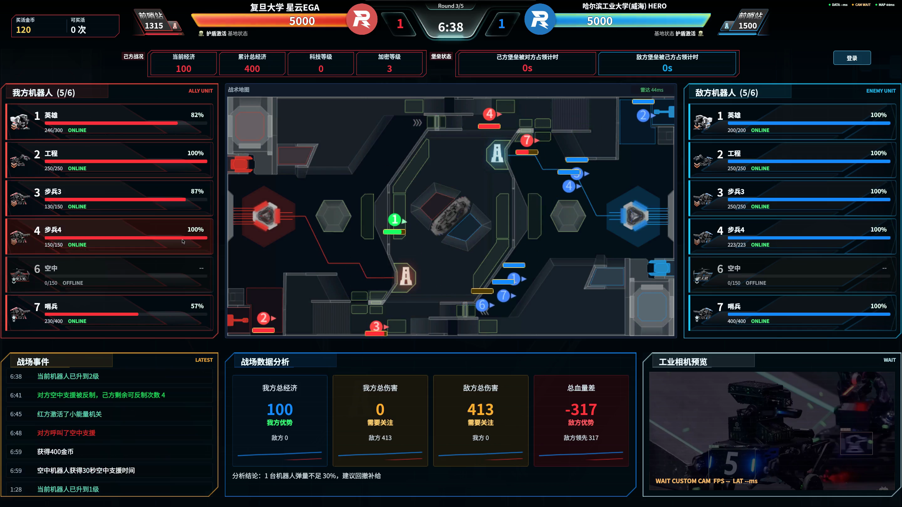
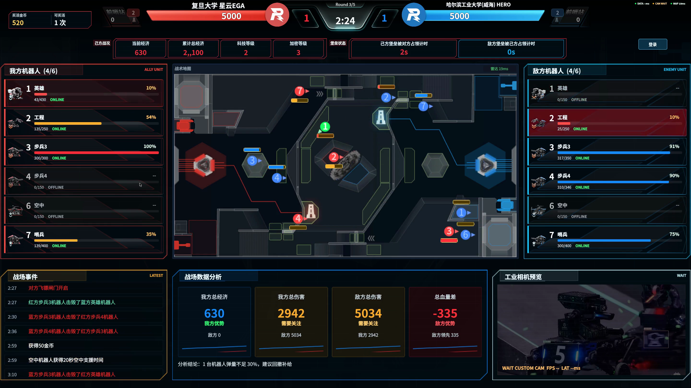
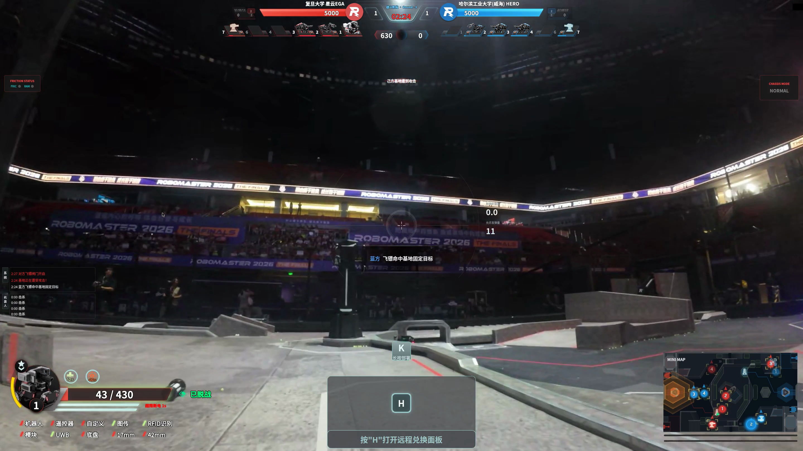
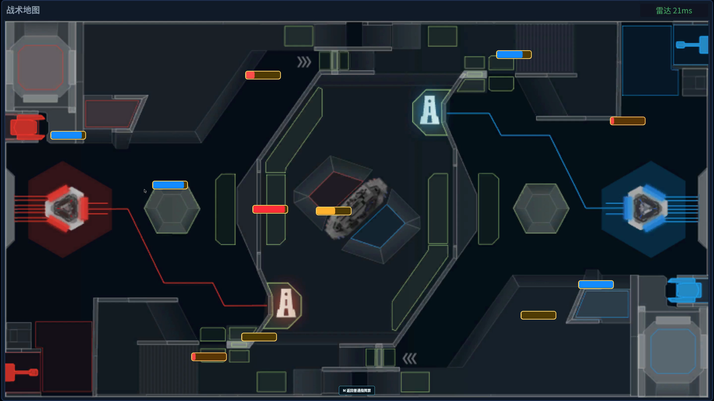
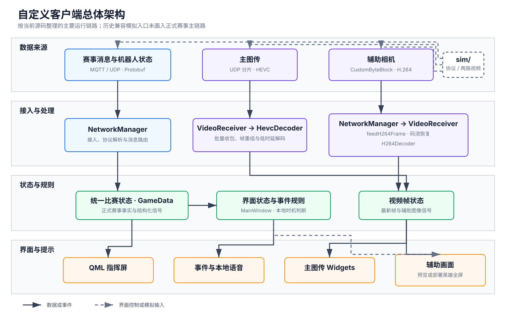
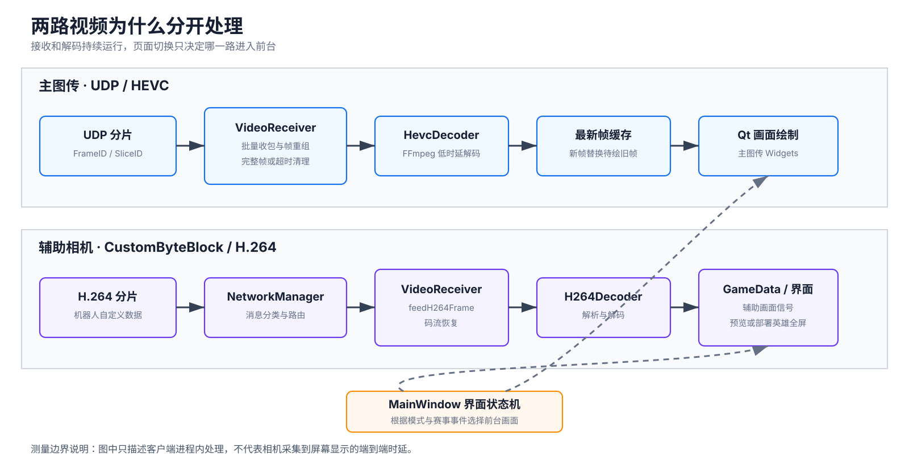
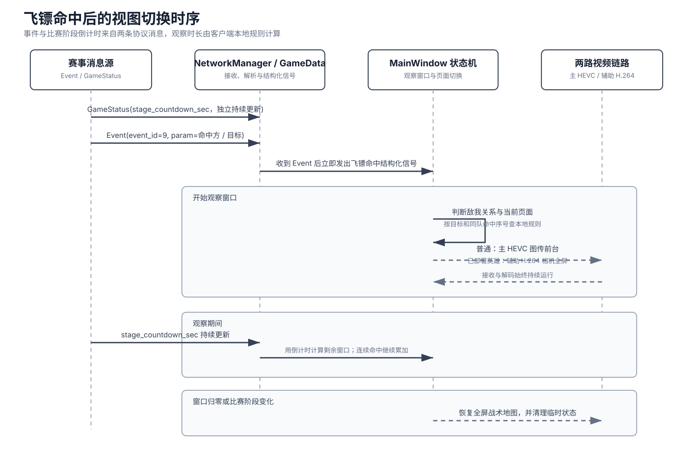

# 【RM2026-复旦大学-星云 EGA 战队】自定义客户端与比赛模拟器开源

> 项目源代码采用 MIT License；本文使用的赛场截图、演示视频和技术图已经完成公开范围确认。

> 本项目由复旦大学星云 EGA 战队独立开发，与 DJI 或 RoboMaster 无隶属或官方合作关系。RoboMaster 等名称和标识归其权利人所有。

- **开源仓库：** <https://github.com/ClearWei/RM26_Client>
- **发布方式：** 提供源码，由使用者按文档安装依赖并构建
- **主要技术：** Qt 6、C++17、QML、FFmpeg、Protobuf、MQTT

## 写在前面

这套客户端最初只有一个很直接的目标：让下一场比赛少漏掉一个状态、少做一次无意义的切换。

操作手既要控车，又要看位置、血量、资源、比赛阶段和突发事件。信息本身并不少，麻烦的是它们分散在不同位置，关键时刻还要自己找页面。于是我们从赛事协议接入开始，把比赛状态、战术地图、两路视频和语音提示逐步接到同一个客户端里。配套模拟器把场上的关键输入搬到本地，测试和文档则把复现方式留下来。

下面这张画面来自一段连续对战录屏。比赛时钟、双方机器人位置和血量、事件与统计在同一个界面中持续更新。右下角辅助相机在这段素材中没有开启，画面重点是比赛状态、地图和事件的连续更新。



_图 1｜实际比赛中的综合指挥界面，截取自连续对战录屏 00:30。_

<video controls preload="metadata" width="100%" poster="./assets/2026-rm26-custom-client/screenshots/client-overview.png">
  <source src="./assets/2026-rm26-custom-client/videos/match-overview.mp4" type="video/mp4">
</video>

[当前页面无法内嵌播放时，点击查看 20 秒连续运行片段](./assets/2026-rm26-custom-client/videos/match-overview.mp4)

## 它在场上解决了什么

### 把零散信息放进同一条决策链

正式赛事消息的主链路会先把裁判系统消息、机器人状态和雷达信息整理成统一比赛状态，再由指挥屏、事件提示和语音规则读取。网络层负责接入和解析，QML 从统一状态中取数，使一项比赛事实尽量只有一个权威来源。历史兼容模拟入口保留了少量直接解析逻辑，新开发使用独立模拟器和统一状态链路。

地图负责空间关系，事件列表负责记录已经发生的事情，语音只提示需要马上注意的时机。对能量机关、飞镖闸门、基地受击等重点提示，我们分别增加了比赛阶段、操作位、时间窗口或防重复规则；其他事件仍按各自的协议语义处理。

### 飞镖命中后，少一次手动找图传

飞镖命中后的几秒通常最忙。原来需要操作手离开战术地图、切到图传，观察结束后再手动返回。现在客户端会在命中后自动把图传放到前台，并在观察窗口结束后回到全屏战术地图。普通情况下显示主 HEVC 图传；当前机器人是已部署英雄时，则显示辅助相机。观察时长由命中目标和同队命中序号共同决定，连续命中会继续累加。

| 00:44｜切换前 | 00:45｜图传置于前台 | 00:55｜恢复战术地图 |
| --- | --- | --- |
|  |  |  |

_图 2｜同一段连续录屏中的三个关键时刻，依次记录事件发生、图传切换和地图恢复。自动触发关系由状态机实现和测试共同验证。_

<video controls preload="metadata" width="100%" poster="./assets/2026-rm26-custom-client/screenshots/dart-during.png">
  <source src="./assets/2026-rm26-custom-client/videos/dart-hit-auto-switch.mp4" type="video/mp4">
</video>

[当前页面无法内嵌播放时，点击查看 15 秒飞镖命中切屏片段](./assets/2026-rm26-custom-client/videos/dart-hit-auto-switch.mp4)

### 大地图与基地状态的两段记录

全屏战术地图用于集中观察双方位置和血量，普通指挥界面同时保留资源、事件和辅助画面。下面的短片记录了战术地图，以及飞镖命中、基地护甲展开和基地受击等状态。视频约在 00:09 切换到另一个回合，前后两段分别展示两类画面。

<video controls preload="metadata" width="100%" poster="./assets/2026-rm26-custom-client/screenshots/tactical-map.png">
  <source src="./assets/2026-rm26-custom-client/videos/tactical-map-and-base-status.mp4" type="video/mp4">
</video>

[当前页面无法内嵌播放时，点击查看战术地图与基地状态片段](./assets/2026-rm26-custom-client/videos/tactical-map-and-base-status.mp4)

_视频说明｜原录屏 00:00—00:09 与 00:27—00:37；00:09 后为另一回合。_

## 客户端是怎么组织的

系统大致分为四层：数据来源、接入与处理、统一状态与规则、界面与提示。比赛消息经 `NetworkManager` 接入并解析，确认后的事实进入 `GameData`；主 HEVC 图传走独立的 UDP 接收与解码链路，辅助 H.264 则由 `CustomByteBlock` 经 `NetworkManager` 路由到 `VideoReceiver`，完成码流恢复和解码后再进入界面。界面状态机只负责决定地图、视频和提示在什么时候出现。



_图 3｜客户端总体组成与主要数据流。实线表示数据或事件，虚线表示界面控制。_

这张图保留了最主要的运行链路。`MainWindow`、`GameData` 和 `NetworkManager` 承担多项职责，是源码中较集中的几个耦合点。独立的 `sim/` 作为外部协议对端运行；进程内模拟模块用于兼容已有开发流程，新功能使用独立模拟器。

## 两路视频为什么要分开处理

主图传通过 UDP 接收 HEVC 分片，在高优先级工作线程中完成批量收包、帧重组和低时延解码。当绘制速度暂时跟不上时，新帧会替换尚未显示的旧帧，避免画面看起来流畅、实际却已经过时。

辅助相机使用机器人自定义数据承载 H.264 分片，经过独立的码流恢复和解码链路进入界面。两条链路持续工作，界面切换只改变前台显示，不临时重启接收或解码。



_图 4｜主 HEVC 图传与辅助 H.264 相机的处理路径。_

客户端可以记录从首个 UDP 分片进入进程到完成画面绘制的端内耗时，方便在相同环境下比较改动前后的差异。仓库没有发布缺少完整证据链的历史数字。这项指标的范围也不包含相机采集、赛事引擎处理和上游网络传输，使用时应与相机到屏幕的端到端时延区分。

## 飞镖命中切屏由赛事事件驱动

切屏由赛事事件直接驱动，没有模拟键盘输入。`Event` 提供命中方和目标，`GameStatus` 单独提供比赛阶段倒计时；界面状态机判断敌我关系和当前页面，再用本地规则计算观察窗口。图传接收与解码在切换前后持续运行；窗口归零或比赛阶段变化时，临时状态被清理，界面回到全屏战术地图。



_图 5｜飞镖命中事件触发的视图切换时序。连续命中会在当前窗口上累加观察时间。_

## 为什么把模拟器一起开源

很多问题只有比赛走到特定阶段才会出现。为了验证一次提示、一个页面切换或者一条异常消息，不可能每次都占用完整场地、赛事引擎和机器人。

配套的 `sim/` 提供本地 Web 控制台，可以修改比赛阶段、机器人状态、资源和事件，再通过 MQTT、UDP 或视频链路把数据发送给客户端。客户端仍走正常接入路径，因此同一个问题可以重复复现，也更适合补回归测试。模拟器是本地开发用的协议对端；真实赛事环境的兼容性仍需现场联调。

## 这次开源什么

| 内容 | 可以看到什么 |
| --- | --- |
| Qt/C++ 客户端 | 协议接入、统一比赛状态、地图、事件、Widgets/QML 混合界面与视频链路 |
| 独立模拟器 | FastAPI、Socket.IO、MQTT、UDP 和视频组成的本地协议对端 |
| 测试与验证工具 | 状态、协议路由、比赛推进、界面状态机、视频恢复和架构边界检查 |
| 项目文档 | 构建、配置、架构、协议边界、学习路径、贡献方式和发布门槛 |

这些内容可以用来学习赛事消息怎样进入统一状态、状态怎样驱动地图、语音和视频，以及没有完整赛场环境时怎样复现关键流程。

## 最短构建与验证路径

仓库以源码形式发布。完整依赖和平台差异以仓库 [README](../../README.md) 为准，下面保留最短入口。

```bash
python3 tools/release/check_example_config.py config.example.json
cmake --preset release
cmake --build --preset release
ctest --preset release
```

根目录没有 `config.json` 时，CMake 会从公开示例生成安全的运行配置。需要修改 Broker、机器人 ID
或视频参数时，再把 `config.example.json` 复制为本地 `config.json`；该文件由 Git 忽略，不应提交。

构建完成后，Linux 与 macOS 的启动入口分别为：

```bash
# Linux
./build/release/RoboMasterClient2025

# macOS
./build/release/RoboMasterClient2025.app/Contents/MacOS/RoboMasterClient2025
```

`RoboMasterClient2025` 是为兼容现有脚本保留的构建目标名，与协议版本无关。

模拟器使用 Python 3.11 或更高版本，并需要本机 MQTT Broker：

```bash
python3 -m venv sim/.venv
source sim/.venv/bin/activate
python -m pip install --upgrade pip setuptools wheel
python -m pip install -e sim
RM_MQTT_HOST_PORT=3333 ./sim/run_sim.sh
```

浏览器打开 `http://127.0.0.1:8000`。默认命令只启动协议服务；两路视频需要在 Web 控制台中分别选择素材并启动。也可以用 `./sim/run_sim.sh --video-file /绝对路径/演示视频.mp4` 额外启动主 HEVC 发送器，客户端主图传监听端口保持为 `3334`。

客户端与模拟器必须连接同一个 Broker。上面的环境变量让 Docker 回退路径也使用 `3333`；若启动日志显示 Broker 实际位于 `11883`，请把客户端 `config.json` 中的 `mqtt_port` 同步改为 `11883`。公开示例只连接本机，不包含现场地址、账号或比赛身份。

## 发布内容与适用范围

项目采用 MIT License，公开仓库提供客户端、模拟器、测试、文档和素材台账登记的固定快照。
真实配置、现场地址、任务记录、调试日志和内部方案不属于开源内容。

Quality CI 在 Ubuntu 24.04 上执行仓库检查、QML 检查、原生构建和自动测试。Windows、Linux
桌面长期运行、真实裁判系统、网络抖动和现场动作需要使用者结合自己的环境复核。发布内容为
源码，不含预编译的桌面安装包、容器镜像或模拟器 wheel。

## 为什么现在开源

这套客户端已经进入过正式比赛流程。好用的功能留下来了，不好用的地方也逼着我们改过。如果代码只停在队内，它最终仍会变成下一届队员不敢动的一份旧工程。

所以我们决定趁功能和问题都还记得，把源码、模拟器和必要说明一起整理出来。有人真的按 README 跑起来，发现一处文档和实现对不上，或者补出一个能复现的问题，都会比一句“欢迎共建”更有价值。

## 参考、致谢与交流

这篇发布稿参考了星云 EGA 战队此前的[平衡步兵强化学习控制训练开源](https://bbs.robomaster.com/article/1940342)和[云台滑模控制器教学与开源](https://bbs.robomaster.com/article/1939327)。前一篇保留了真实的选型过程和踩坑记录，后一篇把技术说明和实现放在了一起。

感谢参与客户端、模拟器、现场联调、测试和文档整理的队员，也感谢愿意公开赛季经验的 RoboMaster 社区开发者。贡献者和素材作者信息以仓库中的公开记录为准。

问题复现和改进建议请走公开仓库的 Issue；安全问题请按照 `SECURITY.md` 使用私密渠道报告。涉及真实赛事网络、设备或比赛命令的测试，必须在自己拥有或明确获准使用的环境中进行。
