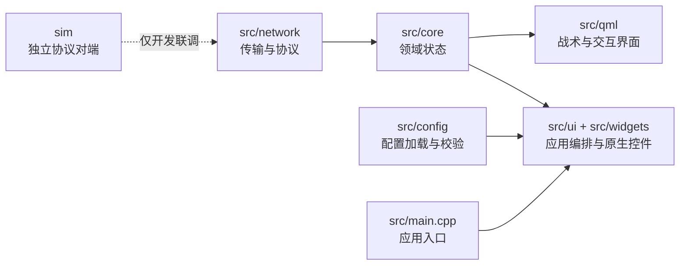

# RM26 客户端开发指南

本文面向第一次参与 RM26 Custom Client 的外部开发者，介绍如何准备环境、构建客户端、
定位代码、完成验证并提交 Pull Request。项目使用 Qt 6、C++17 和 CMake；独立模拟器使用
Python，可在没有赛事引擎和机器人硬件时提供开发数据。

> [!IMPORTANT]
> 项目源代码采用 MIT License。开始贡献前请先阅读[贡献指南](../CONTRIBUTING.md)；新增第三方
> 代码或素材时，仍需单独登记来源、许可证、授权范围和必要署名。

如果只是想运行项目，先看根目录的[快速开始](../README.md#快速开始)。本文重点说明修改代码
时需要理解的边界和交付要求。

## 1. 开发环境

### 1.1 基础依赖

| 组件 | 要求 | 用途 |
| --- | --- | --- |
| CMake | 3.21 或更高版本 | 使用仓库内的 CMake Presets |
| C++ 编译器 | 支持 C++17 | AppleClang、Clang、GCC 或 MSVC |
| Qt | Qt 6 | 客户端、QML 和 QtTest |
| Protobuf、Abseil | 必需 | 协议代码和基础依赖 |
| Paho MQTT C | 可选 | 缺失时不启用 MQTT 功能 |
| FFmpeg | 可选 | H.264/H.265 解码；可在配置时关闭 |
| Python | 运行模拟器时需要 3.11 或更高版本 | 客户端构建本身不依赖 Python |

客户端使用的 Qt 组件包括 Core、Concurrent、Widgets、Multimedia、Network、SerialPort、
Svg、Quick、QuickWidgets 和 QuickControls2；构建测试还需要 Qt Test、Qml 和 Quick。
`devtools` Preset 额外需要 Qt HttpServer，普通客户端开发不必安装或启用它。

macOS 可以使用 Homebrew 安装主要依赖：

```bash
brew install cmake qt@6 protobuf abseil libpaho-mqtt ffmpeg
```

Ubuntu 24.04 的依赖清单以
[客户端 Dockerfile](../docker/client.Dockerfile)为参考。Windows 可以使用 Visual Studio
或 Ninja 生成器，但应确保 CMake 找到同一套 Qt、Protobuf 和 Abseil，避免混用不同包管理器
产生的二进制。

项目标准构建入口是 CMake，不使用 qmake 工程文件。

### 1.2 获取代码

从项目维护者公布的仓库地址克隆代码，然后进入仓库根目录：

```bash
git clone <repository-url> RM26CustomClient
cd RM26CustomClient
cmake --list-presets
```

`cmake --list-presets` 应能看到 `dev`、`release`、`devtools` 和维护者使用的 `ci`。如果 Preset 未出现，先确认
CMake 版本和当前目录，不要手工创建另一套构建脚本。

## 2. 配置、构建与运行

### 2.1 选择 Preset

| Preset | 构建类型 | 适用场景 |
| --- | --- | --- |
| `dev` | Debug | 日常开发和单元测试 |
| `release` | Release | 发布候选和性能接近现场的验证 |
| `devtools` | RelWithDebInfo | 维护者显式启用本地观测接口时使用 |
| `ci` | Release | Ubuntu CI 的 Ninja、ccache 与受控并行构建 |

四个 Preset 都会启用测试和资源校验。正式业务逻辑不能依赖 `devtools` 或 `ci` 才能工作。

### 2.2 准备本地配置

全新克隆先复制脱敏示例，再检查它仍然只使用本机地址：

```bash
cp config.example.json config.json
python3 tools/release/check_example_config.py config.json
```

Windows PowerShell 使用 `Copy-Item config.example.json config.json -Force`。已有现场配置的团队工作区
不要直接覆盖。字段和环境变量见[配置说明](getting-started/configuration.md)。

### 2.3 日常开发构建

```bash
cmake --preset dev
cmake --build --preset dev
ctest --preset dev
```

构建目录由 Preset 固定为 `build/<preset>`，例如 `build/dev`。不要在同一个构建目录中混用
不同 Qt 版本或生成器；切换工具链时使用新的构建目录更容易排查问题。

如果本机暂时不需要视频解码，可以显式关闭 FFmpeg：

```bash
cmake --preset dev -DRM_WITH_FFMPEG=OFF
cmake --build --preset dev
```

### 2.4 发布构建

```bash
cmake --preset release
cmake --build --preset release
ctest --preset release
```

项目名称为 `RM26CustomClient`；可执行目标在 1.x 期间继续使用兼容名 `RoboMasterClient2025`。
重命名时需同步更新启动脚本、打包配置和兼容迁移说明。

### 2.5 运行客户端

| 环境 | `dev` Preset 的常见路径 |
| --- | --- |
| Linux | `./build/dev/RoboMasterClient2025` |
| macOS | `./build/dev/RoboMasterClient2025.app/Contents/MacOS/RoboMasterClient2025` |
| Windows + Visual Studio | `.\build\dev\Debug\RoboMasterClient2025.exe` |
| Windows + Ninja | `.\build\dev\RoboMasterClient2025.exe` |

首次运行前检查根目录的 `config.json`。配置加载和校验实现位于
[`src/config`](../src/config/)；公开示例由 `tools/release/check_example_config.py` 做更严格的安全与
完整性检查。真实 IP、账号、密钥路径、抓包和比赛运行记录不得写入可提交配置。需要本地差异时，
使用 `git status --short --ignored` 确认 `config.json` 仍处于忽略状态，不要强制暂存。

## 3. 模块边界

客户端当前的大部分生产代码会编入 `RoboMasterClientLib`。因此目录边界主要依靠代码审查
和测试维护，不能因为链接成功就认为依赖方向合理。



| 路径 | 负责什么 | 不应放什么 |
| --- | --- | --- |
| `src/config` | 配置读取、默认值、环境覆盖和校验 | 比赛规则、页面布局 |
| `src/core` | 比赛状态、纯规则、状态投影和分析逻辑 | 网络连接、窗口生命周期 |
| `src/network` | MQTT、UDP、Protobuf、视频收包与解码 | QML 页面和战术布局 |
| `src/ui` | `MainWindow`、应用组合、快捷键和页面生命周期 | 原始 payload 解析 |
| `src/widgets` | 原生 Qt 控件和视频承载 | 传输连接管理 |
| `src/qml` | 战术地图、状态面板和交互展示 | 原始协议解析、无类型网络调用 |
| `src/devhooks` | 可选的开发观测接口 | 正式业务规则、默认控制入口 |
| `sim` | 独立的 Python/Web 协议对端 | 生产客户端运行时依赖 |
| `tests` | QtTest 和基准测试 | 现场账号、不可复现数据 |
| `tests`、`tools/release` | 测试和发布检查 | 客户端的第二套业务实现 |

详细说明见[系统架构概览](architecture/overview.md)。以下兼容实现需要特别注意：

- `src/simulator/ProtocolSimulator.*` 是仍由客户端创建的进程内兼容实现，不等同于独立
  `sim/`。新增模拟能力优先放在 `sim/`，不要继续扩大两套模拟器的重叠职责。

## 4. 典型改动路径

### 4.1 开始修改前

1. 搜索已有 issue、同类实现和测试。
2. 明确改动是否影响可见行为、协议、配置、线程或现场动作。
3. 新功能、协议调整、目录重组和大范围重构先建立 issue；明确缺陷可以提交小型 PR。
4. 记录计划执行的验证命令，以及受条件限制无法验证的部分。

可独立验证的 C++ 行为应补充或更新 QtTest；纯文档、样式和平台配置改动按实际风险选择验证
方式。

### 4.2 按改动类型定位文件

| 需求 | 通常从哪里开始 | 同时检查 |
| --- | --- | --- |
| 调整 QML 布局或样式 | `src/qml/*.qml`、`src/qml/Tactical/` | `qml.qrc`、`qmldir`、不同缩放比例 |
| 修改原生控件或视频承载 | `src/widgets` | `src/ui/MainWindow.*`、相关 QtTest |
| 修改快捷键、页面切换或动作策略 | `src/ui` | 默认拒绝策略、状态重置、集成测试 |
| 修改比赛状态或分析规则 | `src/core` | `GameData` 投影、信号、对应单元测试 |
| 修改配置项 | `src/config` | 默认值、校验、环境覆盖和文档 |
| 修改 MQTT、UDP 或消息路由 | `src/network` | 生命周期、重连、线程退出、协议测试 |
| 修改视频组帧或解码恢复 | `src/network`、`src/widgets` | 无 FFmpeg 构建、损坏数据和重连测试 |
| 修改模拟比赛状态 | `sim/server` | 客户端消费端、协议检查、隔离冒烟 |
| 新增图片、字体、音视频 | `resources` | 资源引用、`ASSET_LICENSES.md`、再分发授权 |

不要为了“整理目录”在同一个 PR 中同时改接口、业务行为和文件位置。先用测试固定行为，再做
范围清晰的迁移，审查和回退都会更可靠。

## 5. 测试与验证

### 5.1 基础验证

普通 C++ 或 QML 改动至少执行：

```bash
cmake --build --preset dev
ctest --preset dev
```

第一次构建、修改 CMake 或切换依赖后，先重新配置：

```bash
cmake --preset dev
cmake --build --preset dev
ctest --preset dev
```

只运行相关测试时可以使用 CTest 名称，例如：

```bash
cmake --build --preset dev --target test_game_data
ctest --preset dev -R '^TestGameData$'
```

常见测试入口包括：

| 改动领域 | 可先运行的测试 |
| --- | --- |
| 领域状态与规则 | `TestGameData`、`TestTacticalAnalyzer`、`TestTimedEventRules` |
| 快捷键和动作策略 | `TestInputHotkeyPolicy`、`TestExchangeCommandPolicy` |
| QML 与页面状态 | `TestSettingsPanelShortcuts`、`TestTacticalCommandPage` |
| MQTT 和协议 | `TestMqttManager`、`TestProtocol`、`TestProtobuf` |
| 视频数据包记录 | `TestVideoDatagramLogger` |

表中名称用于快速定位相关测试。提交前仍应执行完整 CTest，并按改动补充手工或集成证据。

### 5.2 专项检查

修改协议、网络或发布边界时运行：

```bash
python3 tools/release/check_sim_protobuf_runtime.py
python3 tools/release/check_runtime_resources.py
python3 tools/release/check_public_readiness.py
```

### 5.3 无法自动化的证据

- QML 布局：记录窗口尺寸、缩放比例和改动前后截图。
- 视频链路：记录输入编码、分辨率、帧率、丢包条件和恢复结果。
- 平台问题：写明操作系统、编译器、Qt 版本、生成器和构建选项。
- 现场问题：写明未覆盖范围，不要用一次成功启动代替稳定性结论。

截图、字体、音视频和 fixture 必须确认有权公开后才能进入仓库。

## 6. 协议改动

协议相关改动风险较高。语义冲突时按以下顺序判断：

1. 团队核验过的 RoboMaster 2026 通信协议和勘误；版本入口及校验值见
   [官方资料索引](references/official-materials.md)。
2. [`protocol_manifest.json`](../src/network/proto/protocol_manifest.json) 声明的兼容目标。
3. [`robomaster.proto`](../src/network/proto/robomaster.proto) 中的仓库 schema。
4. 经过测试的 C++ 路由、解析和 `GameData` 投影。
5. 模拟器、历史文档和临时脚本。

官方资料是语义来源，不等于可以随仓库再分发。不要提交官方 PDF、逐页截图或 OCR 全文。

### 6.1 推荐改动顺序

1. 在 issue 或 PR 中写清 topic/command ID、方向、transport、payload、频率和兼容影响。
2. 只有兼容目标版本变化时才更新 `protocol_manifest.json`，不要为普通实现修复改写版本证据。
3. 更新 `robomaster.proto`，保留字段编号、presence、枚举和值域兼容性。
4. 更新 `src/network` 中的解析、序列化和路由。
5. 更新 `src/core/GameData.*` 或其他状态投影，并检查信号语义。
6. 如果模拟器消费或发送该消息，同步核对 `sim/server`，并由 canonical schema 重新生成 pb2。
7. 更新[协议边界说明](architecture/protocol-boundary.md)或相关绑定文档。
8. 增加 descriptor、golden payload 或行为测试，并运行完整协议检查与 CTest。

客户端和模拟器的协议代码均由 canonical schema 生成。涉及公共消息时先阅读
[Protobuf 单一 Schema 维护说明](maintainers/protocol-convergence-plan.md)，不要手工修改生成的 pb2。

### 6.2 协议 PR 至少说明

- 官方版本或勘误依据；
- 修改前后的字段、方向和频率；
- C++ 客户端与模拟器各自的兼容结果；
- 旧消息、旧字段或旧配置的处理方式；
- 实际运行过的测试，以及没有完成的双端或现场验证。

## 7. 使用模拟器联调

独立模拟器位于 `sim/`，是客户端的协议对端，不是生产客户端依赖。完整参数见
[模拟器说明](../sim/README.md)。

### 7.1 安装与启动

```bash
python3 -m venv sim/.venv
source sim/.venv/bin/activate
python -m pip install --upgrade pip setuptools wheel
python -m pip install -e sim
./sim/run_sim.sh --no-video \
  --mqtt-host 127.0.0.1 \
  --target-ip 127.0.0.1
```

Windows PowerShell 的虚拟环境命令以及视频参数见模拟器说明。默认 Web 控制台地址为
`http://127.0.0.1:8000`。

模拟器需要 Mosquitto 或兼容的 MQTT Broker。客户端与模拟器必须使用相同的 Broker 地址、
端口和机器人 ID。基本联调建议按以下顺序进行：

1. 使用独立本地 Broker，先以 `--no-video` 启动模拟器。
2. 打开 Web 控制台，确认状态变化能够发布。
3. 启动 `dev` 构建的客户端，确认连接、状态投影和退出流程。
4. 再分别启用 UDP 或视频，避免一次引入多个变量。
5. 记录客户端日志、模拟器日志和具体配置，不记录真实现场凭据。

模拟器测试包括 Python 赛事推进用例和 JavaScript 地图几何用例，命令见
[验证说明](development/verification.md)。修改模拟器时还应完成协议检查，以及启动、状态发布和
正常退出的隔离冒烟。服务启动结果只记录进程可用性，完整回归以对应测试和链路证据为准。

配置字段变更时，同步更新 `config.example.json`、配置说明和示例检查测试。

## 8. 安全边界

- 默认使用本机、隔离 Broker、模拟器或有明确授权的测试环境。
- 不扫描、连接、控制或干扰未经授权的赛事网络和设备。
- 赛事命令、按键注入和其他真实动作必须默认拒绝，并由操作者在确认环境后显式授权。
- `devtools` 和 `src/devhooks` 只用于可选观测，不能成为绕过业务授权的控制通道。
- 现场地址、SSH 配置、账号、密钥、抓包和运行日志不得进入提交。
- 真实链路问题不能只看客户端一端；有授权的联调应同时保留发送端与接收端证据，并写明
  时钟同步和采集限制。
- 安全问题不要提交公开 issue，按[安全策略](../SECURITY.md)私下报告。

普通功能开发不需要连接真实赛事环境。若问题只能在现场复现，应先提交脱敏日志和最小复现，
由维护者确认授权、时间窗口和回退方案后再联调。

## 9. 常见问题

### CMake 找不到 Qt

确认 Qt 6 安装完整，并让 CMake 指向对应 kit：

```bash
cmake --preset dev -DCMAKE_PREFIX_PATH=/path/to/Qt/6.x/<kit>
```

不要把个人绝对路径写入 `CMakeLists.txt` 或提交到 Preset。

### 找不到 Protobuf 或 Abseil

确认开发包和 CMake 配置文件来自兼容的工具链。清理或换用新的构建目录后重新配置，避免
同时找到系统库、Homebrew、vcpkg 等多套版本。

### 配置时提示 MQTT 不可用

安装 Paho MQTT C 后重新运行 CMake 配置。没有 MQTT 的构建仍可用于部分界面和纯逻辑测试，
但不能据此判断赛事通信已经通过。

### FFmpeg 配置失败

需要视频功能时安装 FFmpeg 开发库；只做其他模块时可暂时使用：

```bash
cmake --preset dev -DRM_WITH_FFMPEG=OFF
```

PR 中应说明该构建没有验证 H.264/H.265 解码。

### 新增 QML 文件后运行时找不到组件

检查文件是否加入 `src/qml/qml.qrc`，模块组件是否需要登记到 `src/qml/qmldir`，然后重新
构建。不要只依赖 IDE 中能打开文件。

### 修改测试后 CTest 看不到新目标

先在 `tests/CMakeLists.txt` 注册目标，再重新配置和构建：

```bash
cmake --preset dev
cmake --build --preset dev
ctest --preset dev -N
```

### 模拟器启动了，但客户端没有数据

依次核对 Broker 地址与端口、机器人 ID、UDP 目标地址、端口占用和客户端 `config.json`。
先关闭视频和额外发送器，只保留一个状态通道定位问题。

### 资源校验失败

先修复缺失文件、大小写、空格或不可移植路径。不要把关闭 `RM_VALIDATE_ASSETS` 当作默认
解决办法；新增素材还必须完成来源和授权登记。

## 10. PR 交付

提交前检查：

```bash
git status --short
git diff --check
cmake --build --preset dev
ctest --preset dev
```

再根据改动运行协议、架构、模拟器或平台专项检查。PR 描述至少包含：

1. 问题背景和目标；
2. 行为是否变化，以及用户能观察到什么；
3. 修改的模块和没有修改的边界；
4. 实际执行的命令、结果、平台和关键依赖版本；
5. 未验证项、已知限制和回退方式；
6. 协议、配置、线程、安全或素材影响；
7. 有权公开的界面截图或日志片段（适用时）。

保持提交小而聚焦，不混入构建产物、个人配置、无关格式化或来源不明素材。不要写“所有测试
通过”而不列出命令，也不要把没有运行的测试写成已完成。

完整要求见[贡献指南](../CONTRIBUTING.md)和[编码规范](development/coding-style.md)。

## 11. 发布前检查

```bash
python3 tools/release/check_docs.py
python3 -m unittest discover -s tools/release/tests -p 'test_*.py' -v
```

发布检查用于确认文档、配置、资源和公开快照完整性，不能代替 CMake、CTest、代码审查和现场人工授权。

## 相关文档

- [项目 README](../README.md)
- [贡献指南](../CONTRIBUTING.md)
- [文档导航](README.md)
- [系统架构概览](architecture/overview.md)
- [组件职责与数据流](architecture/data-flow.md)
- [传输接入与链路诊断](architecture/transport-integration.md)
- [战术分析](architecture/tactical-analysis.md)
- [模拟器架构](architecture/simulator.md)
- [线程模型](architecture/threading-model.md)
- [测试策略](architecture/testing.md)
- [协议边界](architecture/protocol-boundary.md)
- [验证说明](development/verification.md)
