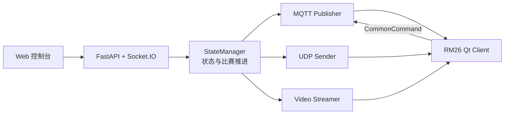

# RM26 模拟器

RM26 模拟器是自定义客户端的独立协议对端，用于在没有赛事引擎和机器人硬件时复现比赛
状态、赛事命令、地图数据和视频输入。它不属于生产客户端的运行时依赖。

## 数据链路



正式入口是 `server/main.py`，`server.py` 只保留旧命令兼容。`run_sim.sh` 最终以
`python -m server.main` 启动服务。

## 环境要求

- Python 3.11 或更高版本
- Python Protobuf `6.33.2` 或更高的 `6.x` 版本
- Mosquitto 或兼容的 MQTT Broker
- FFmpeg（仅视频相关功能需要）
- Node.js 18 或更高版本（仅运行前端几何测试需要）

## 安装

在仓库根目录执行：

```bash
python3 -m venv sim/.venv
source sim/.venv/bin/activate
python -m pip install --upgrade pip setuptools wheel
python -m pip install -e sim
```

Windows PowerShell 使用：

```powershell
py -3.11 -m venv sim/.venv
sim/.venv/Scripts/Activate.ps1
python -m pip install --upgrade pip setuptools wheel
python -m pip install -e sim
```

不要使用 `sudo pip` 或 `--break-system-packages` 安装依赖。

## 启动

```bash
./sim/run_sim.sh
```

默认只启动协议服务，Web 地址为 `http://127.0.0.1:8000`；需要模拟视频图传时，通过
`--video-only` 或 `--video-file` 显式启用。启动脚本只会停止自己创建的子进程；Web 端口已被
占用时会直接报错，不会替用户结束占用端口的程序。

| 参数 | 作用 |
| --- | --- |
| `--no-video` | 禁用独立视频发送器，只启动协议服务 |
| `--video-only` | 只启动独立视频发送器，通常与 `--video-file` 一起使用 |
| `--video-file <path>` | 指定视频文件并启用独立视频发送器 |
| `--web-port <port>` | 设置 Web 端口，并在启动前检查实际端口是否可用 |
| `--target-ip <ip>` | 设置 UDP 和视频发送目标，默认 `127.0.0.1` |
| `--mqtt-host <host>` / `--mqtt-port <port>` | 设置 MQTT Broker，默认使用本机 |
| `--current-robot-id <id>` | 设置模拟器当前机器人视角 |
| `--enable-receiver` / `--enable-udp-sender` | 显式启用兼容 UDP 接收或发送链路 |

只启动协议服务：

```bash
./sim/run_sim.sh --no-video
```

只使用指定文件模拟视频图传：

```bash
./sim/run_sim.sh --video-only --video-file /path/to/demo.mp4
```

模拟器与客户端应显式使用同一组 Broker 地址、端口和机器人 ID。通过环境变量覆盖配置时，
请同时检查客户端的 `config.json`。正式入口 `run_sim.sh` 默认使用 `3333`；只有直接执行
`python -m server.main` 时，服务端自身的 MQTT 默认值才是 `1883`。两种启动方式不要混用默认端口。

## 验证

```bash
python3 tools/release/check_sim_protobuf_runtime.py
python3 -m unittest discover -s sim/tests -t sim -p 'test_*.py' -v
node --test sim/tests/test_map_geometry.js
```

`robomaster_pb2.py` 会在导入时校验生成器与运行时版本。两份依赖声明和
生成代码的最低版本必须保持一致。检查器还会临时从 canonical schema 生成 descriptor，拒绝
提交的 pb2 发生语义漂移；不要通过删除版本校验或弱化 descriptor 比较绕过问题。

协议变化后从仓库根目录重新生成：

```bash
python3 tools/release/generate_sim_protobuf.py
python3 tools/release/check_sim_protobuf_runtime.py
```

Python 测试覆盖一键赛事演示的阶段推进、暂停恢复、事件幂等、血量边界、红蓝方视角和手动
覆盖；JavaScript 测试覆盖地图坐标在缩放与高 DPI 场景下的换算。两组测试均从仓库根目录运行，
并已接入 Quality CI。涉及 Broker、视频和客户端显示的改动仍需补隔离环境冒烟，不能用单元测试
代替完整链路验证。

## 开发约束

- `src/network/proto/robomaster.proto` 是唯一人工维护的 RoboMaster schema；模拟器 pb2 必须由它
  机械生成，不得在 `sim/` 重新建立协议副本。
- Web、MQTT 和 UDP 入口不得各自维护一套比赛命令语义。
- 模块导入不应连接网络或启动后台线程；生命周期应由应用入口统一管理。
- 现场或远程动作默认禁止，只有调用者显式授权后才允许发送。
- 测试数据可以进入仓库，真实 IP、账号、抓包和比赛运行记录不进入公开树。

应用工厂拆分和全量协议字段审计仍在路线图中，进展见
[项目路线图](../ROADMAP.md)与[模拟器架构说明](../docs/architecture/simulator.md)。
